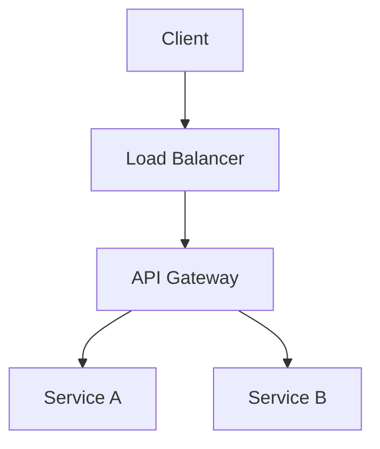
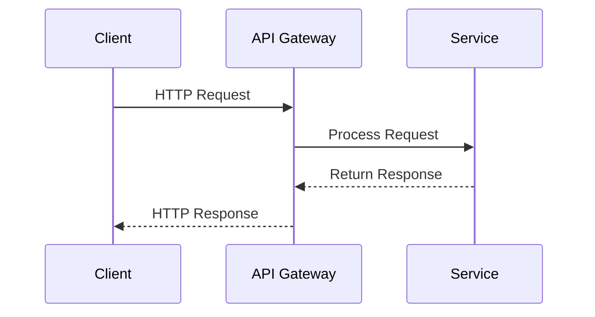
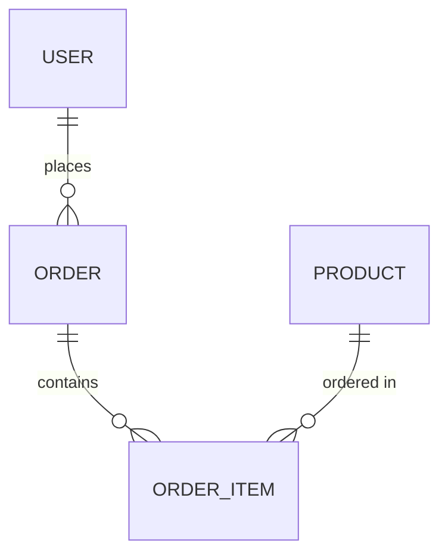

# Documentation

ドキュメント作成のベストプラクティスに関する共通ルールです。

## 概要

このルールは、ドキュメント作成のベストプラクティス、Mermaid記法の活用、ドキュメントの構造化を定義します。理解しやすく、保守しやすいドキュメントを作成するための基本原則です。

## 基本原則

### 1. ドキュメント作成の原則

**ドキュメント作成の基本方針**:
- **明確性**: 明確で理解しやすい内容
- **完全性**: 必要な情報を網羅
- **最新性**: コードと同期を保つ
- **構造化**: 論理的な構造で整理

**ドキュメントの種類**:
- **要件定義**: 機能の要件を定義
- **API仕様**: APIエンドポイントの仕様
- **アーキテクチャドキュメント**: システムの設計
- **README**: プロジェクトの概要とセットアップ手順

### 2. Mermaid記法の活用

**Mermaid記法の推奨用途**:
- **システム構成図**: `graph TD`、`graph LR`を使用
- **シーケンス図**: `sequenceDiagram`を使用
- **データベース図**: `erDiagram`を使用
- **フローチャート**: `flowchart TD`、`flowchart LR`を使用
- **CI/CDパイプライン**: `flowchart TD`を使用

**Mermaid記法の例**:

**システム構成図**:


**シーケンス図**:


**データベースER図**:


### 3. ドキュメントの構造

**ドキュメントの推奨構造**:
```markdown
# タイトル

## 概要
このドキュメントの目的と適用範囲

## 基本原則
基本的な原則や方針

## 具体的な指針
具体的な実装方法や例

## 例外・特別なケース
特別な状況での対応

## 参考リンク
関連するドキュメントやリソース
```

### 4. 図の配置と説明

**図の配置ルール**:
- 各セクションの冒頭に概要図を配置
- 詳細説明の前に具体的な図を配置
- 図の直後に説明文を記載
- 複雑な図は分割して複数の図に分ける

**図の保守方針**:
- アーキテクチャ変更時は必ず図を更新
- 図のバージョン管理を実施
- 図の変更履歴を記録
- 定期的な図の見直しを実施

## 具体的な指針

### 要件定義書

**要件定義書の構成**:
- 機能概要
- 技術要件
- API仕様
- データモデル
- 非機能要件

### API仕様書

**API仕様書の構成**:
- エンドポイント一覧
- リクエスト/レスポンス形式
- 認証・認可
- エラーレスポンス
- 使用例

### アーキテクチャドキュメント

**アーキテクチャドキュメントの構成**:
- システム構成図
- モジュールごとの目的
- 技術スタックと選定理由
- 非機能要件の概要
- アーキテクチャ上の主要な判断

### 5. プロジェクトドキュメント構造（`/docs`配下）

**プロジェクト開始時の標準フォルダ構成**:

すべてのプロジェクトでは、コーディング以前のテキスト情報整理を行うため、`/docs`配下に以下のフォルダ構造を標準として用意します。

```
docs/
├── consideration/      # 要件検討
│   ├── README.md      # 要件検討のガイドライン
│   └── [feature-name].md  # 機能ごとの要件検討ドキュメント
├── todo/              # 要件具体化の実装計画
│   ├── README.md      # TODO管理のガイドライン
│   └── [YYYYMMDD]_[task-name].md  # タスクごとの実装計画
├── reference/          # 参考資料管理
│   ├── README.md      # 参考資料の管理方法
│   └── [category]/   # カテゴリ別の参考資料
├── history/           # 作業記録（タイムスタンプごとのマークダウン）
│   ├── README.md      # 作業記録の管理方法
│   └── [YYYYMMDD]_[summary].md  # 日付ごとの作業記録
└── requirement/       # 仕様書・要件定義
    ├── README.md      # 要件定義のガイドライン
    └── [feature-name].md  # 機能ごとの要件定義書
```

**各フォルダの役割**:

#### 5.1 `consideration/` - 要件検討

**目的**: 機能や要件を検討する段階の情報を管理

**用途**:
- 機能の検討事項の記録
- 複数の選択肢の比較
- 検討中の課題の整理
- 意思決定の記録

**ファイル命名規則**:
- `[feature-name].md`: 機能名で命名
- 例: `user-authentication.md`, `payment-integration.md`

#### 5.2 `todo/` - 要件具体化の実装計画

**目的**: 要件を具体化し、実装計画を立てる段階の情報を管理

**用途**:
- 実装タスクの分解
- 実装順序の決定
- 依存関係の整理
- 工数見積もり

**ファイル命名規則**:
- `[YYYYMMDD]_[task-name].md`: 日付とタスク名で命名
- 例: `20240115_user-login-implementation.md`

#### 5.3 `reference/` - 参考資料管理

**目的**: プロジェクトに関連する参考資料を管理

**用途**:
- 技術ドキュメントのリンク
- 参考にした記事やブログ
- 外部APIの仕様書
- 設計パターンの参考資料

**ファイル命名規則**:
- カテゴリ別にフォルダを分ける
- 例: `api-docs/`, `design-patterns/`, `tutorials/`

#### 5.4 `history/` - 作業記録

**目的**: タイムスタンプごとの作業記録を管理

**用途**:
- 日々の作業内容の記録
- 決定事項の記録
- 問題と解決策の記録
- 会議の議事録

**ファイル命名規則**:
- `[YYYYMMDD]_[summary].md`: 日付と概要で命名
- 例: `20240115_daily-standup.md`, `20240116_architecture-decision.md`

**推奨フォーマット**:
```markdown
# [日付] [概要]

## 作業内容
- [ ] タスク1
- [ ] タスク2

## 決定事項
- 決定1: [内容]
- 決定2: [内容]

## 課題・問題
- 課題1: [内容]
- 解決策: [内容]

## 次回の予定
- [ ] 次回タスク1
- [ ] 次回タスク2
```

#### 5.5 `requirement/` - 仕様書・要件定義

**目的**: 仕様検討したものを具体的に仕様書・要件定義化する

**用途**:
- 機能の要件定義書
- API仕様書
- データモデル定義
- 非機能要件の定義

**ファイル命名規則**:
- `[feature-name].md`: 機能名で命名
- 例: `user-authentication-requirements.md`, `api-specification.md`

**推奨フォーマット**:
```markdown
# [機能名] 要件定義

## 概要
機能の概要と目的

## 機能要件
- 要件1: [内容]
- 要件2: [内容]

## 非機能要件
- パフォーマンス: [要件]
- セキュリティ: [要件]

## 技術要件
- 技術スタック: [内容]
- 依存関係: [内容]

## 参考資料
- [リンク1](url)
- [リンク2](url)
```

### 6. プロジェクト開始時のセットアップ

**新規プロジェクト開始時**:

1. **テンプレートのコピー**:
   ```bash
   # 共通ルールリポジトリからテンプレートをコピー
   cp -r .ai-rules/templates/docs-structure/* ./docs/
   ```

2. **READMEファイルの確認**:
   - 各フォルダの`README.md`を確認
   - プロジェクトに合わせてカスタマイズ

3. **初期ドキュメントの作成**:
   - `docs/consideration/`に初期要件検討を記録
   - `docs/todo/`に実装計画を作成
   - `docs/history/`にプロジェクト開始記録を作成

## 例外・特別なケース

### レガシーコードのドキュメント化

既存のコードベースのドキュメント化:
- 段階的なドキュメント化
- 重要な部分から優先的に
- コードと同期を保つ

## 参考リンク

- [Mermaid Documentation](https://mermaid.js.org/)
- [Markdown Guide](https://www.markdownguide.org/)
- [Documentation Best Practices](https://www.writethedocs.org/guide/)

