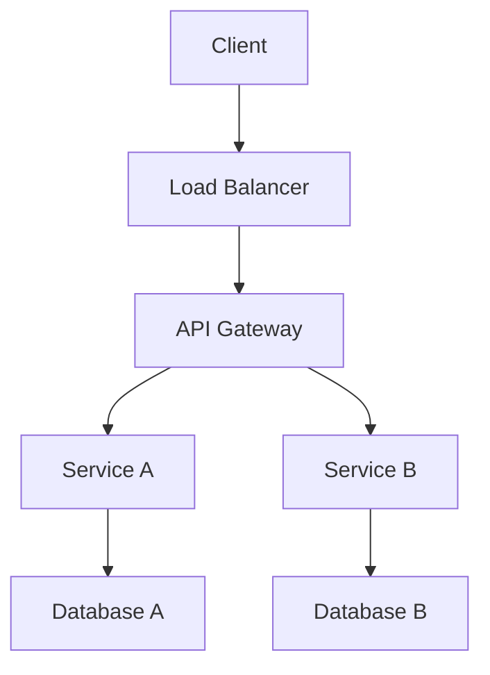
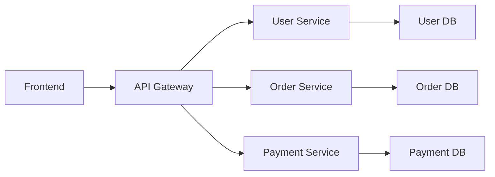
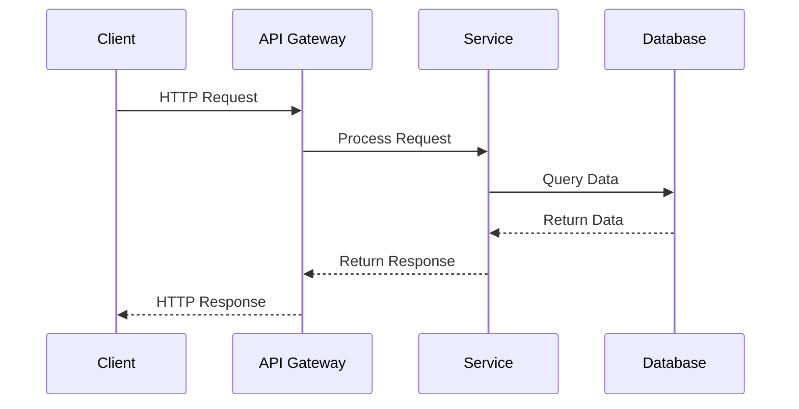
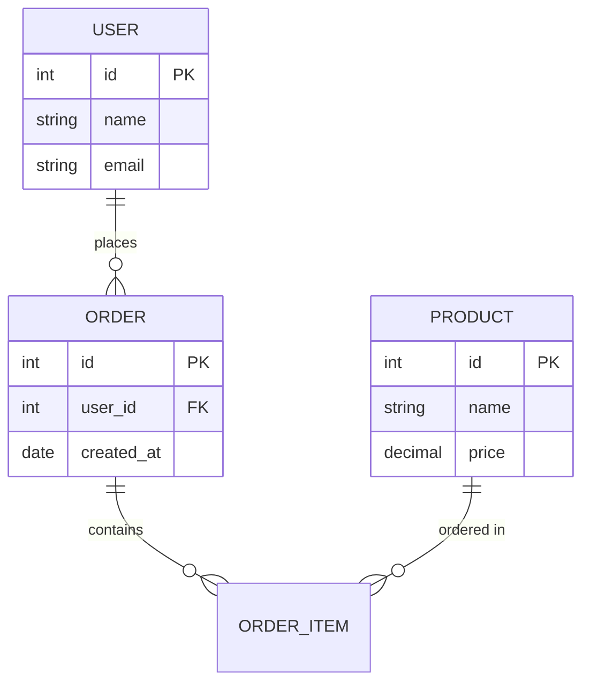
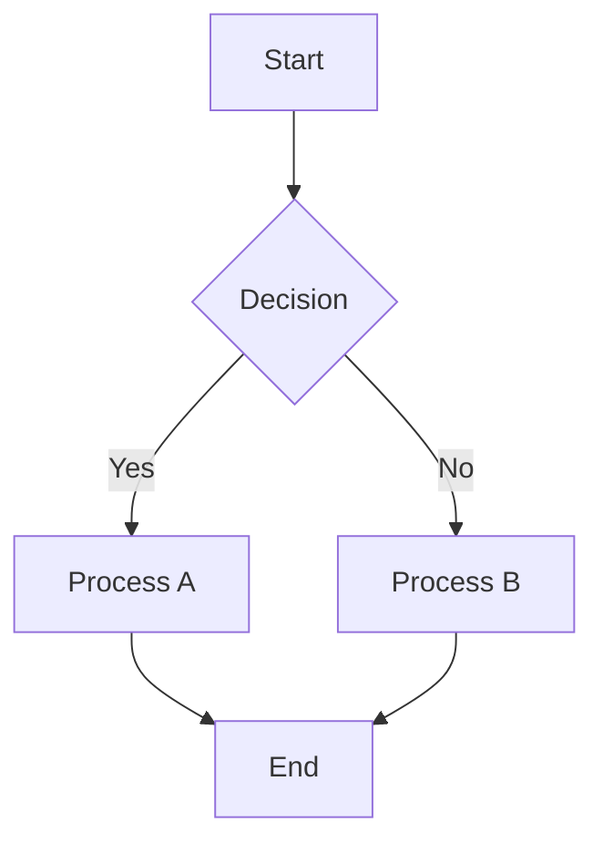
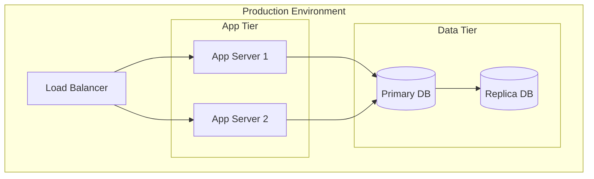
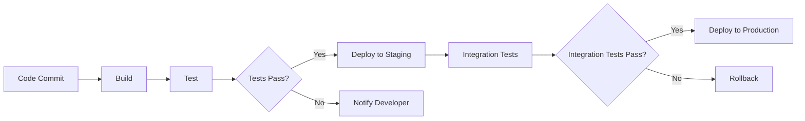

# [PROJECT_NAME] - Cursor Rules

## プロジェクト概要
[PROJECT_NAME]は、モノレポ構造で構成されるバックエンドシステムです。
共通基盤（0000_common）と各機能モジュール（0010_[module-name]、0020_[module-name]等）で構成されます。

## アーキテクチャ原則

### 1. モノレポ構造
- `0000_common/`: 全機能で共通使用する基盤ライブラリ
- `0010_[module-name]/`: 機能モジュール1（例: データ取得機能）
- `0020_[module-name]/`: 機能モジュール2（例: データ抽出機能）
- `docs/`: 要件定義書とAPI仕様書

### 2. 共通基盤の活用
- 新機能開発時は必ず`@[PROJECT_NAME]/common`または`@[ORGANIZATION]/common`を活用
- 重複する機能（設定管理、ログ、DB接続等）は共通基盤を使用
- 共通基盤にない機能は、まず共通化の可能性を検討

#### 2.1 共通化の判断基準
**共通基盤（`0000_common`）で実装すべき機能:**
- **設定管理**: 環境変数、API設定、データベース設定等
- **インフラ設定**: Cloud Build、Cloud Run、Scheduler設定等
- **デプロイ設定**: 環境別デプロイスクリプト、設定ファイル等
- **ユーティリティ**: ログ、エラーハンドリング、データ変換等
- **型定義**: 共通で使用される型、インターフェース等

**モジュール固有で実装すべき機能:**
- **ビジネスロジック**: 各モジュール固有の処理
- **API実装**: モジュール固有のエンドポイント
- **データ処理**: モジュール固有のデータ変換・処理

#### 2.2 共通化の判断フロー
```
1. 機能の分析
   ↓
2. 他モジュールでの使用可能性の確認
   ↓
3. 共通化のメリット・デメリットの評価
   ↓
4. 共通基盤での実装 vs モジュール固有実装の判断
   ↓
5. 共通基盤での実装（推奨）
```

#### 2.3 共通化の実装ルール
- **設定系**: 必ず`0000_common/src/config/`で実装
- **インフラ系**: 必ず`0000_common/`で実装
- **ユーティリティ系**: 必ず`0000_common/src/utils/`で実装
- **型定義系**: 必ず`0000_common/src/types/`で実装

#### 2.4 依存関係管理とビルド順序の原則

**🚨 重要な依存関係管理ルール:**

**1. ビルド順序の厳守**
- **0000モジュールを必ず先にビルド**: 共通基盤のビルド完了後に各モジュールをビルド
- **依存関係の解決**: 0000モジュールの`dist`ディレクトリが作成されてから0010、0020をビルド
- **疎結合維持**: 0000モジュールを共通基盤として保持

**2. Dockerfileでのビルド順序実装**
```dockerfile
# 正しいビルド順序（必須）
# 0000モジュールのビルド（先に実行）
RUN cd 0000_common && npm run build

# 0010モジュールのビルド（0000の後に実行）
RUN cd 0010_[module-name] && npm run build

# 0020モジュールのビルド（0000の後に実行）
RUN cd 0020_[module-name] && npm run build
```

**3. @[PROJECT_NAME]/commonモジュール参照エラーの防止**
- **エラー例**: `Cannot find module '@[PROJECT_NAME]/common' or its corresponding type declarations`
- **原因**: 0000モジュールがビルドされる前に0010、0020モジュールをビルドしている
- **解決策**: 必ず0000モジュールを先にビルドしてから各モジュールをビルド

**4. 依存関係の解決確認**
- **ビルド前確認**: 0000モジュールの`dist`ディレクトリが存在することを確認
- **TypeScriptコンパイル**: 0000モジュールの型定義が利用可能であることを確認
- **npm install**: 各モジュールで`@[PROJECT_NAME]/common`が正しく参照されることを確認

**5. 疎結合維持の実装パターン**
- **共通基盤**: 0000モジュールで環境変数・設定を一元管理
- **モジュール依存**: 0010、0020モジュールは0000モジュールに依存
- **設定一元管理**: 環境変数、API設定、ログ設定を0000で管理

**6. ビルドエラーの診断手順**
```bash
# Step 1: 0000モジュールのビルド確認
cd 0000_common && npm run build

# Step 2: distディレクトリの存在確認
ls -la 0000_common/dist/

# Step 3: 各モジュールのビルド確認
cd 0010_[module-name] && npm run build
cd 0020_[module-name] && npm run build
```

**7. 禁止事項**
- **❌ 禁止**: 0000モジュールをビルドせずに0010、0020をビルド
- **❌ 禁止**: ビルド順序を無視したDockerfileの実装
- **❌ 禁止**: 依存関係の解決確認なしでのビルド実行

**8. 推奨事項**
- **✅ 推奨**: 0000モジュールのビルド完了確認後に各モジュールをビルド
- **✅ 推奨**: Dockerfileでビルド順序を明示的に実装
- **✅ 推奨**: ビルドエラー時は依存関係の解決状況を確認

### 3. データベース開発アプローチ

#### 3.1 4層環境構成
**データベース開発の段階的アプローチ:**
```
ローカル開発 → ローカルSupabase → 開発環境Supabase → 本番環境Supabase
```

**各環境の役割:**
- **ローカル開発**: 一次開発・テスト用（localhost:54321）
- **ローカルSupabase**: ローカル環境でのデータベース開発・テスト
- **開発環境Supabase**: 統合テスト・検証用（[DEV_SUPABASE_PROJECT_ID]）
- **本番環境Supabase**: 本番運用用（[PROD_SUPABASE_PROJECT_ID]）

#### 3.2 データベース開発フロー

**Step 1: ローカル開発**
```bash
# ローカルSupabase環境の起動
node scripts/supabase-environment-manager.js start

# ローカル環境へのマイグレーション
npm run supabase:migrate:local

# ローカル環境でのテスト
npm run test:local
```

**Step 2: ローカルSupabase**
```bash
# ローカルSupabase環境の確認
node scripts/supabase-environment-manager.js test

# ローカルSupabaseでの統合テスト
npm run test:integration
```

**Step 3: 開発環境Supabase**
```bash
# 開発環境へのマイグレーション
npm run supabase:migrate:dev

# 開発環境での統合テスト
npm run test:dev
```

**Step 4: 本番環境Supabase**
```bash
# 本番環境へのマイグレーション（慎重に実行）
npm run supabase:migrate:prod

# 本番環境での動作確認
npm run test:prod
```

#### 3.3 データベース管理ルール

**マイグレーション管理:**
- **ローカル**: 開発中のマイグレーション
- **開発環境**: 検証済みマイグレーション
- **本番環境**: 本番適用済みマイグレーション

**データ管理:**
- **ローカル**: テストデータのみ
- **開発環境**: 本番データのコピー
- **本番環境**: 本番データ

**スキーマ同期:**
- **ローカル → 開発**: 自動マイグレーション適用
- **開発 → 本番**: 手動確認後適用
- **スキーマ比較**: `node scripts/compare-environments.js`

#### 3.4 環境切り替えの実装

**環境管理スクリプト:**
```bash
# ローカル環境に切り替え
node scripts/supabase-environment-manager.js switch local

# 開発環境に切り替え
node scripts/supabase-environment-manager.js switch development

# 本番環境に切り替え
node scripts/supabase-environment-manager.js switch production
```

**環境変数の自動管理:**
- `.env`ファイルの自動更新
- 環境別の設定値の自動切り替え
- プロジェクト固有のキー管理

#### 3.5 データベース開発のベストプラクティス

**1. 段階的開発**
- ローカル環境での開発完了後に次の環境へ
- 各環境での動作確認を必須とする
- 本番環境への適用は慎重に実行

**2. データの整合性**
- 環境間でのデータの整合性を常に維持
- スキーマ変更時は全環境で同期
- データ移行時は整合性チェックを実施

**3. テストの実施**
- 各環境での単体テスト実行
- 統合テストの実施
- 本番環境での動作確認

**4. ロールバック計画**
- 各環境でのロールバック手順を準備
- マイグレーションのロールバック機能
- データの復旧手順の整備

## コーディング規約

### 1. TypeScript
- 厳密な型チェックを有効化（`exactOptionalPropertyTypes: true`）
- 環境変数アクセスは`process.env['VAR_NAME']`形式を使用
- オプショナルプロパティは`| undefined`を明示的に指定
- 型定義は`src/types/`ディレクトリに集約

### 2. 設定管理
- 環境変数は`EnvironmentManager`クラスで管理
- 設定値は`ConfigManager`で一元管理
- プラットフォーム別設定（外部API等）は`ApiConfig`で管理

### 3. ログ管理
- 構造化ログ（JSON形式）を使用
- `LogHelper`クラスの静的メソッドを使用
- ログレベル：`error`, `warn`, `info`, `debug`, `verbose`
- メタデータを含むログを推奨

### 4. エラーハンドリング
- カスタムエラーは`AppError`クラスを継承
- エラーレベルとステータスコードを適切に設定
- ログにエラー詳細を含める

### 5. データベース
- Supabaseクライアントは`SupabaseService`で管理
- 接続プールとエラーハンドリングを適切に実装
- トランザクション処理は`SupabaseTransaction`を使用

## ファイル構造

### 共通基盤（0000_common）
```
src/
├── config/          # 設定管理
├── middleware/      # Expressミドルウェア
├── server/          # HTTPサーバー基盤
├── services/        # サービス層
│   ├── base/        # 基底クラス
│   ├── external/    # 外部APIサービス
│   └── supabase/    # データベースサービス
├── types/           # 型定義
└── utils/           # ユーティリティ
```

### 機能モジュール
```
src/
├── config/          # 共通基盤からインポート
├── services/        # ビジネスロジック
├── types/           # 共通基盤からインポート
└── utils/           # 共通基盤からインポート
```

## 開発フロー

### 1. 新機能開発（TDD推奨）
1. 要件定義書を`docs/requirement/`に作成
2. 共通基盤で利用可能な機能を確認
3. **テストスクリプトを`test-script/`に作成**（TDD: Red）
4. 必要に応じて共通基盤を拡張
5. **機能モジュールを実装**（TDD: Green）
6. **リファクタリングとテスト改善**（TDD: Refactor）
7. ドキュメント更新

### 1.1 統合フロー開発（TDD推奨）
**統合フロー実装の段階的アプローチ:**
```
ローカル統合テスト → 統合フロー実装 → ローカル動作確認 → デプロイ → 本番動作確認
```

**統合フロー開発手順:**
1. **統合要件の分析**: モジュール間の連携要件を明確化
2. **ローカル統合テストの作成**: `test-script/integration/`に統合テストスクリプトを作成
3. **統合フロー実装**: モジュール間の連携ロジックを実装
4. **ローカル動作確認**: 統合フローのローカル環境での動作確認
5. **統合テスト実行**: 統合テストスクリプトの実行と検証
6. **デプロイと本番確認**: 統合フローの本番環境での動作確認

### 2. 共通基盤拡張（TDD推奨）
1. 既存機能での重複を特定
2. 共通化可能な機能を抽出
3. **共通基盤のテストを`test-script/`に作成**（TDD: Red）
4. 共通基盤に実装（TDD: Green）
5. 既存機能を共通基盤使用に移行
6. **リファクタリングとテスト改善**（TDD: Refactor）
7. ドキュメント更新

### 3. バグ修正（TDD推奨）
1. **再現テストを`test-script/`に作成**（TDD: Red）
2. 原因調査と分析
3. 修正方針を提示して承認を得る
4. **修正スクリプトを`test-script/fix/`に作成**
5. **修正を実装**（TDD: Green）
6. **リファクタリングとテスト改善**（TDD: Refactor）
7. **修正スクリプトをドキュメント化**
8. 結果報告

### 4. テスト実行のタイミング
- **開発中**: 各機能実装後に単体テスト実行
- **統合フロー開発中**: 統合フロー実装後に統合テスト実行
- **コミット前**: 全テストスイート実行
- **プルリクエスト前**: 統合テストとE2Eテスト実行
- **デプロイ前**: パフォーマンステスト実行
- **統合フローデプロイ前**: 統合フロー統合テストとE2Eテスト実行

### 4.1 テスト実行方針の詳細

**🚨 テスト実行の根本方針:**

**1. 実装優先のテスト実行**
- **実装の動作確認**: モック作成前に実装の動作を確認
- **実際の依存関係の活用**: 可能な限り実際のサービスを使用
- **段階的なテスト**: 単体 → 統合 → E2Eの順序で実行

**2. モック作成の判断フロー**
```
実装の動作確認 → 技術的制約の調査 → 既存実装の確認 → 代替手段の検討 → モック作成（最後の手段）
```

**3. テスト実行の阻害要因の回避**
- **複雑なモックの回避**: シンプルで理解しやすいテスト構造
- **実装の動作確認**: モック作成前に実装の動作を確認
- **段階的なアプローチ**: 小さなステップで確実に進める

**4. 要件と前提の確認**
- **実装者への確認**: 不明な仕様や前提は必ず確認
- **技術的制約の調査**: 外部依存関係の制約を事前に把握
- **代替手段の検討**: モック以外の解決策を検討

**5. テスト実行の優先順位**
1. **実装の動作確認**: まず実装が正しく動作することを確認
2. **実際の依存関係の活用**: 可能な限り実際のサービスを使用
3. **段階的なテスト**: 単体 → 統合 → E2Eの順序で実行
4. **モック作成**: 最後の手段としてモックを作成

**6. テスト実行の具体的な手順**

**Step 1: 実装の動作確認**
- 実装が正しく動作することを確認
- 基本的な機能が期待通りに動作することを確認
- エラーハンドリングが適切に動作することを確認

**Step 2: 技術的制約の調査**
- 外部依存関係の制約を事前に把握
- 既存実装でモックが不要な場合を確認
- 代替手段（ローカル環境、テストデータ等）の検討

**Step 3: 実際の依存関係の活用**
- 可能な限り実際のサービスを使用
- ローカル環境での動作確認
- テストデータの活用

**Step 4: 段階的なテスト実行**
- 単体テスト: 各サービスの個別テスト
- 統合テスト: サービス間の連携テスト
- E2Eテスト: 完全なフローのテスト

**Step 5: モック作成（最後の手段）**
- 技術的制約により実際の依存関係が使用できない場合のみ
- シンプルで理解しやすいモック構造
- 実装の動作確認後にモックを作成

**7. テスト実行の阻害要因の回避策**

**🚨 テスト実行の阻害要因と回避策:**

**1. 過度なモック化の回避**
- **問題**: 複雑なモックがテスト実行を阻害
- **回避策**: 実装の動作確認を優先し、モックは最後の手段として使用
- **判断基準**: 技術的制約により実際の依存関係が使用できない場合のみ

**2. テスト実行の阻害要因の回避**
- **問題**: モック作成に時間を費やし、実際のテストが進まない
- **回避策**: 実装の動作確認を優先し、段階的なアプローチを採用
- **判断基準**: 実装の動作確認 → 技術的制約の調査 → 代替手段の検討 → モック作成

**3. 根本的なアプローチの誤りの回避**
- **問題**: モック優先でなく、実装優先のアプローチが必要
- **回避策**: 実装の動作確認を優先し、実際の依存関係を活用
- **判断基準**: 実装の動作確認 → 実際の依存関係の活用 → 段階的なテスト → モック作成

**4. 要件と前提の確認**
- **問題**: 不明な仕様や前提によりテスト実行が阻害
- **回避策**: 実装者への確認を優先し、技術的制約を事前に調査
- **判断基準**: 実装者への確認 → 技術的制約の調査 → 代替手段の検討

**8. テスト実行の判断フロー**

**🚨 テスト実行の判断フロー:**

```
実装の動作確認
    ↓
技術的制約の調査
    ↓
既存実装の確認
    ↓
代替手段の検討
    ↓
モック作成（最後の手段）
```

**各ステップの詳細:**

**Step 1: 実装の動作確認**
- 実装が正しく動作することを確認
- 基本的な機能が期待通りに動作することを確認
- エラーハンドリングが適切に動作することを確認

**Step 2: 技術的制約の調査**
- 外部依存関係の制約を事前に把握
- 既存実装でモックが不要な場合を確認
- 代替手段（ローカル環境、テストデータ等）の検討

**Step 3: 既存実装の確認**
- 過去の実装でモックが不要な場合を確認
- 既存のテスト実装を参考にする
- 実装の動作確認結果を活用

**Step 4: 代替手段の検討**
- ローカル環境での動作確認
- テストデータの活用
- 実際の依存関係の活用

**Step 5: モック作成（最後の手段）**
- 技術的制約により実際の依存関係が使用できない場合のみ
- シンプルで理解しやすいモック構造
- 実装の動作確認後にモックを作成

## テスト戦略

### 1. テスト駆動開発（TDD）の推奨

**TDDサイクル:**
1. **Red**: 失敗するテストを書く
2. **Green**: テストを通す最小限のコードを書く
3. **Refactor**: コードを改善し、テストを維持する

**TDDの実装ルール:**
- 新機能開発時は必ずテストから開始
- バグ修正時は再現テストを先に作成
- テストが通るまで実装を進める
- リファクタリング時はテストを維持

### 1.1 テスト戦略の根本原則

**🚨 重要なテスト戦略の原則:**

**1. 実装優先アプローチ**
- **モック作成は最後の手段**: まず実装の動作確認を優先
- **実際の依存関係の活用**: 可能な限り実際のサービスを使用
- **段階的なテスト**: 単体 → 統合 → E2Eの順序で実行

**2. モック作成の判断基準**
- **技術的制約の確認**: 外部API、データベース等の制約を事前に調査
- **既存実装の確認**: 過去の実装でモックが不要な場合を確認
- **代替手段の検討**: ローカル環境、テストデータ等の活用

**3. テスト実行の阻害要因の回避**
- **複雑なモックの回避**: シンプルで理解しやすいテスト構造
- **実装の動作確認**: モック作成前に実装の動作を確認
- **段階的なアプローチ**: 小さなステップで確実に進める

**4. 要件と前提の確認**
- **実装者への確認**: 不明な仕様や前提は必ず確認
- **技術的制約の調査**: 外部依存関係の制約を事前に把握
- **代替手段の検討**: モック以外の解決策を検討

### 2. テストスクリプト管理

**test-scriptフォルダの活用:**
```
test-script/
├── unit/              # 単体テストスクリプト
│   ├── config.test.js
│   ├── logger.test.js
│   └── services.test.js
├── integration/       # 統合テストスクリプト
│   ├── database.test.js
│   ├── api.test.js
│   ├── health.test.js
│   ├── 0010-0020-integration.test.js  # 0010→0020統合フローテスト
│   ├── 0020-0030-integration.test.js  # 0020→0030統合フローテスト
│   └── full-integration.test.js       # 全モジュール統合フローテスト
├── e2e/              # エンドツーエンドテスト
│   ├── [module-name]-flow.test.js
│   ├── [module-name]-flow.test.js
│   └── integrated-flow.test.js        # 統合フローE2Eテスト
├── performance/      # パフォーマンステスト
│   ├── load.test.js
│   ├── memory.test.js
│   └── integration-performance.test.js # 統合フローパフォーマンステスト
├── fix/              # 修正スクリプト管理
│   ├── database/     # データベース修正スクリプト
│   ├── service-fixes/ # サービス修正スクリプト
│   ├── integration-fixes/ # 統合フロー修正スクリプト
│   └── template/   # 修正スクリプトテンプレート
└── utils/            # テストユーティリティ
    ├── test-helpers.js
    ├── mock-data.js
    └── integration-helpers.js         # 統合フローテストヘルパー
```

**テストスクリプトの命名規則:**
- 単体テスト: `[機能名].test.js`
- 統合テスト: `[機能名]-integration.test.js`
- 統合フローテスト: `[モジュール1]-[モジュール2]-integration.test.js`
- パフォーマンステスト: `[機能名]-performance.test.js`
- 修正スクリプト: `[YYYYMMDD]_[モジュール名]_[修正内容]_[バージョン].js`
- ユーティリティ: `[用途]-helper.js`

### 3. ESLint設定の実装例

**`.eslintrc.js`の推奨設定:**
```javascript
module.exports = {
  env: {
    node: true,
    es2021: true,
    jest: true
  },
  extends: [
    'eslint:recommended',
    '@typescript-eslint/recommended'
  ],
  parser: '@typescript-eslint/parser',
  parserOptions: {
    ecmaVersion: 'latest',
    sourceType: 'module'
  },
  plugins: ['@typescript-eslint', 'jest'],
  rules: {
    // プロジェクト全体のルール
    '@typescript-eslint/no-unused-vars': 'error',
    '@typescript-eslint/explicit-function-return-type': 'warn'
  },
  overrides: [
    {
      // テストファイル専用の設定
      files: ['**/__tests__/**/*.[jt]s?(x)', '**/?(*.)+(spec|test).[jt]s?(x)', 'test-script/**/*.js'],
      extends: ['plugin:jest/recommended'],
      rules: {
        'jest/prefer-to-be': 'error',
        'jest/no-disabled-tests': 'warn',
        'jest/no-focused-tests': 'error',
        '@typescript-eslint/no-explicit-any': 'off' // テストではanyを許可
      },
      env: {
        jest: true
      }
    }
  ]
};
```

### 4. Jest設定の実装例

**`jest.config.js`の推奨設定:**
```javascript
module.exports = {
  preset: 'ts-jest',
  testEnvironment: 'node',
  testMatch: [
    '**/__tests__/**/*.[jt]s?(x)',
    '**/?(*.)+(spec|test).[jt]s?(x)',
    'test-script/**/*.test.js'
  ],
  collectCoverage: true,
  coverageDirectory: 'coverage',
  collectCoverageFrom: [
    'src/**/*.{js,ts}',
    '!src/**/*.d.ts',
    '!src/**/__tests__/**',
    '!src/**/index.ts'
  ],
  coverageThreshold: {
    global: {
      branches: 80,
      functions: 80,
      lines: 80,
      statements: 80
    }
  },
  setupFilesAfterEnv: ['<rootDir>/src/__tests__/setup.ts'],
  testTimeout: 10000,
  verbose: true
};
```

### 5. 単体テスト
- 各サービスクラスのテスト
- 共通基盤の機能テスト
- エラーハンドリングのテスト
- テストカバレッジ80%以上を目標

### 6. 統合テスト
- データベース接続テスト
- 外部API連携テスト
- エンドポイントテスト
- モックを使用した外部依存の分離

### 6.1 統合フローテスト
- **モジュール間連携テスト**: 0010→0020、0020→0030等の連携テスト
- **データフローテスト**: モジュール間のデータ受け渡しテスト
- **エラーハンドリングテスト**: 統合フローでのエラー処理テスト
- **パフォーマンステスト**: 統合フローのレスポンス時間とメモリ使用量テスト

### 7. エンドツーエンドテスト
- 完全なユーザーフローのテスト
- 実際の環境での動作確認
- データの整合性チェック

### 7.1 統合フローE2Eテスト
- **完全統合フローテスト**: 0010→0020→0030の完全なフローテスト
- **データ整合性テスト**: 各モジュール間でのデータ整合性確認
- **本番環境テスト**: 統合フローの本番環境での動作確認

### 8. パフォーマンステスト
- レスポンス時間の測定
- メモリ使用量の監視
- 負荷テストの実施

### 8.1 統合フローパフォーマンステスト
- **統合フロー負荷テスト**: 複数モジュール連携時の負荷テスト
- **メモリ使用量監視**: 統合フロー実行時のメモリ使用量監視
- **スループットテスト**: 統合フローの処理能力テスト

### 9. ヘルスチェック
- `/health`: 基本的なヘルスチェック
- `/health/detailed`: 詳細なヘルスチェック（DB、外部API等）
- `/health/integration`: 統合フローのヘルスチェック

## デプロイメント

### 1. 環境設定
- 本番環境: `NODE_ENV=production`
- 開発環境: `NODE_ENV=development`
- 環境変数は`.env`ファイルで管理

### 2. Docker
- 各機能モジュールにDockerfileを配置
- 共通基盤は依存関係として管理
- マルチステージビルドを活用

#### 2.1 Dockerfileでの依存関係管理

**🚨 重要なDockerfile実装ルール:**

**1. ビルド順序の厳守**
```dockerfile
# 正しいビルド順序（必須）
# 0000モジュールのビルド（先に実行）
RUN cd 0000_common && npm run build

# 0010モジュールのビルド（0000の後に実行）
RUN cd 0010_[module-name] && npm run build

# 0020モジュールのビルド（0000の後に実行）
RUN cd 0020_[module-name] && npm run build
```

**2. 依存関係の解決確認**
- **ビルド前確認**: 0000モジュールの`dist`ディレクトリが存在することを確認
- **TypeScriptコンパイル**: 0000モジュールの型定義が利用可能であることを確認
- **npm install**: 各モジュールで`@[PROJECT_NAME]/common`が正しく参照されることを確認

**3. @[PROJECT_NAME]/commonモジュール参照エラーの防止**
- **エラー例**: `Cannot find module '@[PROJECT_NAME]/common' or its corresponding type declarations`
- **原因**: 0000モジュールがビルドされる前に0010、0020モジュールをビルドしている
- **解決策**: 必ず0000モジュールを先にビルドしてから各モジュールをビルド

**4. 疎結合維持の実装パターン**
- **共通基盤**: 0000モジュールで環境変数・設定を一元管理
- **モジュール依存**: 0010、0020モジュールは0000モジュールに依存
- **設定一元管理**: 環境変数、API設定、ログ設定を0000で管理

**5. ビルドエラーの診断手順**
```bash
# Step 1: 0000モジュールのビルド確認
cd 0000_common && npm run build

# Step 2: distディレクトリの存在確認
ls -la 0000_common/dist/

# Step 3: 各モジュールのビルド確認
cd 0010_[module-name] && npm run build
cd 0020_[module-name] && npm run build
```

**6. 禁止事項**
- **❌ 禁止**: 0000モジュールをビルドせずに0010、0020をビルド
- **❌ 禁止**: ビルド順序を無視したDockerfileの実装
- **❌ 禁止**: 依存関係の解決確認なしでのビルド実行

**7. 推奨事項**
- **✅ 推奨**: 0000モジュールのビルド完了確認後に各モジュールをビルド
- **✅ 推奨**: Dockerfileでビルド順序を明示的に実装
- **✅ 推奨**: ビルドエラー時は依存関係の解決状況を確認

### 3. Google Cloud
- Cloud Buildでビルド・デプロイ
- Cloud Schedulerで定期実行
- Cloud Loggingでログ管理

#### 3.1 自動デプロイプロセス（刷新版）

**🚨 重要なデプロイプロセス刷新（2026-01-21）:**

**基本方針: 統合デプロイと自動化**

**1. ブランチ戦略**
```
main (本番環境)
    ↑
develop (開発環境)
    ↑
feature/issue-XXX (機能開発ブランチ)
```

**2. 統合Cloud Buildトリガー**

**開発環境**:
- **トリガー名**: `[PROJECT_NAME]-dev-auto-deploy`
- **ブランチ**: `^develop$` (正規表現)
- **設定ファイル**: `deployment/cloudbuild/integrated/cloudbuild-integrated-simple.yaml`
- **GCPプロジェクト**: `[PROJECT_NAME]-dev`
- **自動デプロイ**: `develop`ブランチへのプッシュで自動実行

**本番環境**:
- **トリガー名**: `[PROJECT_NAME]-prod-auto-deploy`
- **ブランチ**: `^main$` (正規表現)
- **設定ファイル**: `deployment/cloudbuild/integrated/cloudbuild-integrated-simple.yaml`
- **GCPプロジェクト**: `[PROJECT_NAME]-prod`
- **自動デプロイ**: `main`ブランチへのプッシュで自動実行

**3. 統合Dockerfile**

**使用ファイル**: `deployment/dockerfiles/integrated/Dockerfile.integrated`

**ビルド対象モジュール**:
- `0000_common` (共通基盤)
- `0010_[module-name]`
- `0020_[module-name]`
- `0030_[module-name]`
- `0060_[module-name]`
- `0070_[module-name]`

**ビルド順序**:
1. `0000_common`のビルド（依存関係の解決）
2. 各モジュールのビルド（0010, 0020, 0030, 0060, 0070）

**4. Cloud Build設定のロギングオプション**

**必須設定**:
```yaml
options:
  machineType: 'E2_HIGHCPU_8'
  diskSizeGb: 100
  # ロギング設定: サービスアカウント使用時に必要
  default_logs_bucket_behavior: 'REGIONAL_USER_OWNED_BUCKET'
```

**理由**: サービスアカウント使用時、ログバケットまたはロギングオプションの設定が必須

**5. ブランチ保護ルール**

**developブランチ**:
- ✅ プルリクエスト必須
- ✅ 承認必須（1名以上）
- ✅ 管理者も保護ルールを適用（false）

**mainブランチ**:
- ✅ プルリクエスト必須
- ✅ 承認必須（1名以上）
- ✅ 管理者も保護ルールを適用（true）

**6. 自動デプロイフロー**

**開発環境へのデプロイ**:
```
feature/issue-XXXブランチで開発
    ↓
PR作成 (feature/issue-XXX → develop)
    ↓
Devin経由のPR → 自動マージ（GitHub Actions）
通常のPR → コードレビュー → 手動マージ
    ↓
PRマージ (develop)
    ↓
Cloud Build自動実行 ([PROJECT_NAME]-dev-auto-deploy)
    ↓
統合Dockerfileでビルド
    ↓
開発環境へ自動デプロイ
```

**Devin PRの自動マージ機能**:
- **対象**: `develop`ブランチへのPR（Devin経由で作成されたもの）
- **自動マージの条件**:
  - ✅ ベースブランチが`develop`
  - ✅ PRの作成者がDevin（`devin-ai-integration`、`devin-ai`、`[ORGANIZATION][bot]`等）またはPRタイトル/本文に`[Devin]`を含む
  - ✅ ステータスチェックが成功（またはスキップ）
  - ✅ マージ可能な状態
- **自動マージの仕組み**: GitHub Actionsワークフロー（`.github/workflows/auto-merge-devin-prs.yml`）
- **注意事項**:
  - ブランチ保護ルールで「承認必須」が設定されている場合、GitHub AppまたはPersonal Access Tokenが必要な場合があります
  - 本番環境（`main`ブランチ）へのPRは自動マージされません（安全性のため）

**本番環境へのデプロイ**:
```
開発環境での動作確認完了
    ↓
PR作成 (develop → main)
    ↓
コードレビュー（厳格に）
    ↓
PRマージ (main)
    ↓
Cloud Build自動実行 ([PROJECT_NAME]-prod-auto-deploy)
    ↓
統合Dockerfileでビルド
    ↓
本番環境へ自動デプロイ
```

**7. 統合Dockerfileの実装ルール**

**ビルド前の準備**:
```dockerfile
# 全モジュールの依存関係をインストール
COPY package*.json ./
COPY 0000_common/package*.json ./0000_common/
COPY 0010_[module-name]/package*.json ./0010_[module-name]/
# ... 他のモジュールも同様

# 共通基盤のソースコードと設定ファイルをコピー（ビルドに必要）
COPY 0000_common/tsconfig.json ./0000_common/
COPY 0000_common/src ./0000_common/src

# 共通基盤のビルド
WORKDIR /app/0000_common
RUN npm ci && npm run clean && npm run build
```

**各モジュールのビルド**:
```dockerfile
# アプリケーションコードのコピー
COPY . .

# 各モジュールのビルド
RUN cd 0010_[module-name] && npm run build
RUN cd 0020_[module-name] && npm run build
RUN cd 0030_[module-name] && npm run build
RUN cd 0060_[module-name] && npm run build
RUN cd 0070_[module-name] && npm run build
```

**8. 禁止事項**

**❌ やってはいけないこと**:
- モジュール別のCloud Buildトリガーを作成（統合トリガーを使用）
- ブランチ保護ルールを無視した直接プッシュ
- ロギングオプションなしでCloud Build設定を作成
- `0000_common`のビルド前にソースコードをコピーしない

**✅ 必ずやること**:
- 統合Cloud Buildトリガーを使用
- ブランチ保護ルールを遵守
- Cloud Build設定にロギングオプションを追加
- `0000_common`のビルド前に`tsconfig.json`と`src`をコピー

**9. デプロイプロセスの確認手順**

**デプロイ前の確認**:
1. ブランチが正しいか確認（`develop` or `main`）
2. 統合Dockerfileが最新か確認
3. Cloud Build設定にロギングオプションが含まれているか確認
4. ブランチ保護ルールが設定されているか確認

**デプロイ後の確認**:
1. Cloud Buildのビルドログを確認
2. ビルドステータスが`SUCCESS`か確認
3. 開発環境/本番環境での動作確認

**10. デプロイ修正後の結果確認と対応方針**

**🚨 重要な原則：デプロイ修正後の結果確認を必須とする**

**基本方針**:
- **デプロイ修正用のpush後は、必ず結果確認を待つ**
- **結果に応じて、再修正または完了報告を行う**
- **結果確認なしに次の作業に進まない**

**デプロイ修正後のフロー**:
```
デプロイ修正用のpush (develop/main)
    ↓
Cloud Build自動実行
    ↓
結果確認を待つ（ビルド完了まで）
    ↓
結果に応じた対応
    ├─ ビルド成功 → 完了報告
    └─ ビルド失敗 → 原因分析 → 再修正 → push → 結果確認（ループ）
```

**結果確認のタイミング**:
- **ビルド完了まで待機**: Cloud Buildのビルドが完了するまで待つ
- **ビルドログの確認**: ビルドステータスとログを確認
- **エラーの特定**: ビルド失敗時は、エラーの原因を特定

**結果に応じた対応**:

**✅ ビルド成功の場合**:
1. **完了報告**: ビルド成功を報告
2. **動作確認**: 必要に応じて、開発環境/本番環境での動作確認
3. **次の作業へ**: 次のタスクに進む

**❌ ビルド失敗の場合**:
1. **原因分析**: ビルドログからエラーの原因を特定
2. **再修正**: 原因に基づいて修正を実施
3. **修正のpush**: 修正をコミット・プッシュ
4. **結果確認**: 再度ビルド結果を確認（ループ）

**禁止事項**:
- ❌ **結果確認なしに次の作業に進む**: ビルド完了を待たずに次の作業を開始しない
- ❌ **複数の修正を同時にpush**: 1つの修正ごとに結果確認を行う
- ❌ **エラー原因の特定なしに再修正**: 原因を特定せずに推測で修正しない

**推奨事項**:
- ✅ **結果確認を優先**: デプロイ修正後は、結果確認を最優先で行う
- ✅ **段階的な修正**: 1つの修正ごとに結果確認を行い、段階的に進める
- ✅ **詳細なログ確認**: ビルド失敗時は、ビルドログを詳細に確認して原因を特定

**詳細**: `docs/BRANCH_STRATEGY_AND_AUTO_DEPLOYMENT.md`を参照

## セキュリティ

### 1. 環境変数
- 機密情報は環境変数で管理
- `.env`ファイルは`.gitignore`に追加
- 本番環境では適切なシークレット管理

### 2. API認証
- 外部APIキーは適切に管理
- レート制限を実装
- エラーレスポンスに機密情報を含めない

### 3. データベース
- SupabaseのRLS（Row Level Security）を活用
- 適切な権限設定
- 接続文字列の保護

## パフォーマンス

### 1. キャッシュ
- 外部APIレスポンスのキャッシュ
- データベースクエリの最適化
- メモリ使用量の監視

### 2. ログ
- ログレベルを適切に設定
- 本番環境では不要なログを削減
- ログローテーションを設定

## ドキュメント

### 1. 要件定義
- `docs/requirement/`にMarkdown形式で記載
- 機能概要、技術要件、API仕様を含める

### 2. API仕様
- `docs/ref/`にBlueprint形式で記載
- エンドポイント、リクエスト/レスポンス形式を明記

### 3. README
- 各モジュールにREADME.mdを配置
- セットアップ手順、使用方法を記載

## 品質管理

### 1. コード品質
- ESLintでコード品質をチェック
- TypeScriptの厳密な型チェック
- コードレビューを実施
- **TDDによる品質向上**

**ESLint設定の推奨事項:**
- `.eslintrc.js`でプロジェクト全体のルールを設定
- テストファイル専用のルールを`overrides`で分離
- `eslint-plugin-jest`プラグインを追加してテストコードの品質向上
- テストファイルでは`jest`、`test`、`expect`等のグローバル変数を許可

**Jest設定の推奨事項:**
- `jest.config.js`でテストファイルの命名規則を統一
- カバレッジレポートを有効化（80%以上を目標）
- `setupFilesAfterEnv`でテスト環境のセットアップ
- テストファイルは`**/*.test.js`、`**/*.spec.js`パターンで認識

**必要な依存関係:**
```json
{
  "devDependencies": {
    "@types/jest": "^29.5.0",
    "eslint-plugin-jest": "^27.6.0",
    "jest": "^29.7.0",
    "ts-jest": "^29.1.0"
  }
}
```

### 2. テストカバレッジ
- **単体テスト**: 80%以上のカバレッジを目標
- **統合テスト**: 重要な機能は100%カバレッジ
- **E2Eテスト**: 主要なユーザーフローをカバー
- **パフォーマンステスト**: レスポンス時間とメモリ使用量を監視

### 3. テストスクリプトの品質管理
- **test-script/フォルダの活用**: 全テストスクリプトを一元管理
- **test-script/fix/フォルダの活用**: 修正スクリプトを一元管理
- **テストの可読性**: 明確なテスト名とコメント
- **テストの保守性**: モックとヘルパー関数の活用
- **テストの実行性**: どの環境でも実行可能
- **修正スクリプトの管理**: 修正履歴とドキュメント化

### 4. 継続的テスト
- **開発中**: 各機能実装後にテスト実行
- **CI/CD**: 自動テスト実行の設定
- **デプロイ前**: 全テストスイートの実行
- **本番環境**: ヘルスチェックエンドポイントの活用

### 5. 監視
- アプリケーションログの監視
- エラー率とレスポンス時間の監視
- テスト結果の監視
- カバレッジレポートの確認

## 修正作業の実施手順

### 🚨 重要な実装ルール

**絶対に守るべきルール：**

1. **原因調査と分析を先に行う**
   - 問題が発生した場合、まず原因を特定する
   - 現状を詳しく調査・分析する
   - 問題の影響範囲を明確にする

2. **修正方針を提示して承認を得る**
   - 原因分析結果を報告する
   - 複数の修正方針（Option 1, 2, 3...）を提示する
   - 各方針のメリット・デメリットを説明する
   - **ユーザーの判断・承認を待つ**

3. **承認後に修正作業を実施**
   - ユーザーが修正方針を選択・承認してから作業開始
   - 修正内容を明確に説明してから実行
   - 修正中は進捗を報告する

### ❌ 禁止事項

- **いきなり修正作業を開始すること**
- **原因調査なしに推測で修正すること**
- **ユーザーの承認なしにコードを変更すること**
- **複数の修正を同時に実施すること**

### 📝 報告フォーマット

**原因分析報告時：**
```
## 🔍 原因分析結果
- 問題: [具体的な問題]
- 原因: [特定された原因]
- 影響範囲: [影響を受ける範囲]

## 🔧 修正方針の提案
### Option 1: [方針名]
- 内容: [具体的な修正内容]
- メリット: [利点]
- デメリット: [欠点]

### Option 2: [方針名]
- 内容: [具体的な修正内容]
- メリット: [利点]
- デメリット: [欠点]

どの方針で進めますか？
```

## 設定管理と環境変数の実装ルール

### 設定ファイル管理の原則

**1. 統一された設定管理**
- すべての設定ファイルは`0000_common/src/config/`ディレクトリに配置
- 設定ファイルのパスは相対パスで統一
- どのディレクトリから実行しても同じパスでアクセス可能

**2. 環境変数の確実な設定**
```bash
# 正しい環境変数設定方法
export SUPABASE_URL="your_supabase_url"
export SUPABASE_ANON_KEY="your_supabase_anon_key"
export API_KEY="your_api_key"
export NODE_ENV="production"
```

**3. 設定読み込みの実装パターン**
```typescript
// 正しい設定読み込み方法
import { config } from '@[PROJECT_NAME]/common';

// 設定値の取得
const appConfig = config.getAppConfig();
const supabaseConfig = config.getSupabaseConfig();
```

### エラーハンドリングの実装

**1. 設定読み込み失敗時の対応**
- 設定ファイルの存在確認
- 環境変数の設定確認
- 詳細なエラーメッセージの表示

**2. デバッグ情報の提供**
- 設定ファイルのパス表示
- 環境変数の設定状況表示
- インポートパスの確認

### テスト機能の実装

**1. 設定読み込みテスト**
```bash
# 設定読み込みのテスト方法
cd 0010_[module-name]
SUPABASE_URL="test" SUPABASE_ANON_KEY="test" API_KEY="test" node -e "
const { config } = require('@[PROJECT_NAME]/common');
console.log('Config load result:', config.getAppConfig());
"
```

**2. 環境変数確認テスト**
```bash
# 環境変数の確認方法
echo "SUPABASE_URL: ${SUPABASE_URL:0:20}..."
echo "API_KEY: ${API_KEY:0:10}..."
```

### 禁止事項

**❌ やってはいけないこと**
- 設定ファイルのパスをハードコードする
- 環境変数をエクスポートせずにアプリケーションを実行する
- 設定読み込みのテストを行わずに本番実行する
- エラーメッセージを詳細にしない

**✅ 必ずやること**
- 設定ファイルのパスを相対パスで統一
- 環境変数を明示的にエクスポート
- 設定読み込みのテストを実施
- エラー時の詳細なデバッグ情報を提供

## 修正スクリプト管理ガイドライン

### 1. 修正スクリプトの作成

**修正スクリプトの作成手順:**
1. **修正内容の分析**: 修正対象と修正内容を明確にする
2. **修正スクリプトの作成**: `test-script/fix/`に修正スクリプトを作成
3. **修正スクリプトのテスト**: 修正スクリプトの動作確認
4. **修正スクリプトのドキュメント化**: 修正内容と実行手順を記録
5. **修正スクリプトの実行**: 修正スクリプトの実行
6. **修正結果の検証**: 修正が正しく適用されたかの確認

**修正スクリプトの命名規則:**
- ファイル名: `[YYYYMMDD]_[モジュール名]_[修正内容]_[バージョン].js`
- 例: `20241006_0020_[module-name]-service-fix_v1.js`

### 2. 修正スクリプトの管理

**修正スクリプトの分類:**
- **database/**: データベース修正スクリプト
- **service-fixes/**: サービス修正スクリプト
- **template/**: 修正スクリプトテンプレート

**修正スクリプトのドキュメント化:**
- 修正内容の説明
- 修正前後の比較
- 実行手順
- 注意事項
- 関連するIssue/PR

### 3. 修正スクリプトの再利用

**修正スクリプトの再利用方針:**
- 類似問題の解決に修正スクリプトを再利用
- 修正パターンを標準化
- 修正手順をテンプレート化
- 修正ノウハウを蓄積

**修正スクリプトの改善:**
- 修正スクリプトの課題を特定
- 修正スクリプトの改善案を検討
- 修正スクリプトの改善案を実装
- 修正スクリプトの改善効果を測定

## 環境分離デプロイ戦略

### 1. 環境構成の明確化

**3層環境構成:**
- **ローカル環境**: 一次開発・テスト用（localhost:54321）
- **開発環境**: 開発用Supabase（[DEV_SUPABASE_PROJECT_ID]）+ 開発用Cloud Run + 開発用Scheduler
- **本番環境**: 本番用Supabase（[PROD_SUPABASE_PROJECT_ID]）+ 本番用Cloud Run + 本番用Scheduler

### 2. デプロイフローの標準化

**標準デプロイフロー:**
```
ローカル開発 → ローカルSupabase → 一次開発完了 → 開発環境デプロイ → 開発環境テスト → 本番環境デプロイ
```

**デプロイコマンド:**
```bash
# 開発環境のみデプロイ
npm run deploy:dev

# 本番環境のみデプロイ
npm run deploy:prod

# 全環境デプロイ（開発環境のみ）
npm run deploy:all

# 全環境デプロイ（本番環境含む）
npm run deploy:all:prod
```

### 3. 環境別設定管理

**開発環境設定:**
- Supabase: `[DEV_SUPABASE_PROJECT_ID]`
- Cloud Run: `[PROJECT_NAME]-dev`
- Scheduler: `[PROJECT_NAME]-dev-scheduler`
- 実行時間: 毎日午前2時

**本番環境設定:**
- Supabase: `[PROD_SUPABASE_PROJECT_ID]`
- Cloud Run: `[PROJECT_NAME]-prod`
- Scheduler: `[PROJECT_NAME]-prod-scheduler`
- 実行時間: 毎日午前1時

### 4. スキーマ管理

**スキーマ同期の自動化:**
- ローカル → 開発環境: 自動マイグレーション適用
- 開発環境 → 本番環境: 手動確認後適用
- スキーマ比較: `node scripts/compare-environments.js`

### 5. データ移行管理

**データ移行の自動化:**
- 本番 → 開発: `npm run migrate:full`
- データクリア: `node scripts/clear-dev-data.js`
- 環境比較: `node scripts/compare-environments.js`

## 統合フロー実装ガイドライン

### 1. 統合フロー開発の基本原則

**統合フロー実装の段階的アプローチ:**
```
ローカル統合テスト → 統合フロー実装 → ローカル動作確認 → デプロイ → 本番動作確認
```

**統合フロー開発手順:**
1. **統合要件の分析**: モジュール間の連携要件を明確化
2. **ローカル統合テストの作成**: `test-script/integration/`に統合テストスクリプトを作成
3. **統合フロー実装**: モジュール間の連携ロジックを実装
4. **ローカル動作確認**: 統合フローのローカル環境での動作確認
5. **統合テスト実行**: 統合テストスクリプトの実行と検証
6. **デプロイと本番確認**: 統合フローの本番環境での動作確認

### 2. 統合フローテストの実装

**統合フローテストの種類:**
- **モジュール間連携テスト**: 0010→0020、0020→0030等の連携テスト
- **データフローテスト**: モジュール間のデータ受け渡しテスト
- **エラーハンドリングテスト**: 統合フローでのエラー処理テスト
- **パフォーマンステスト**: 統合フローのレスポンス時間とメモリ使用量テスト

**統合フローテストの実装パターン:**
```javascript
// test-script/integration/0010-0020-integration.test.js
describe('0010→0020統合フローテスト', () => {
  test('モジュール1→モジュール2の統合フロー', async () => {
    // 1. 0010モジュールの処理
    const module1Result = await module1Processor.process();
    expect(module1Result.successCount).toBeGreaterThan(0);
    
    // 2. 0020モジュールの処理
    const module2Result = await module2Processor.process();
    expect(module2Result.data.successful).toBeGreaterThan(0);
    
    // 3. データ整合性の確認
    const data = await supabase.from('[table_name]').select('*').eq('[status_field]', true);
    expect(data.data.length).toBeGreaterThan(0);
  });
});
```

### 3. 統合フロー実装のベストプラクティス

**統合フロー実装時の注意事項:**
- **モジュール間の依存関係**: モジュール間の依存関係を明確に定義
- **データフローの設計**: モジュール間のデータ受け渡しを適切に設計
- **エラーハンドリング**: 統合フローでのエラー処理を適切に実装
- **パフォーマンス考慮**: 統合フローのパフォーマンスを考慮した実装

**統合フロー実装パターン:**
```typescript
// 統合フロー実装例
class IntegratedProcessor {
  async processIntegratedFlow(): Promise<IntegratedResult> {
    try {
      // Step 1: 0010 - モジュール1の処理
      const module1Result = await this.module1Processor.process();
      
      // Step 2: 0020 - モジュール2の処理
      const module2Result = await this.module2Processor.process();
      
      // Step 3: 0030 - モジュール3の処理（将来実装）
      // const module3Result = await this.module3Processor.process();
      
      return {
        success: true,
        results: {
          module1: module1Result,
          module2: module2Result
        }
      };
    } catch (error) {
      return {
        success: false,
        error: error.message
      };
    }
  }
}
```

### 4. 統合フローテストの実行

**統合フローテストの実行タイミング:**
- **開発中**: 統合フロー実装後に統合テスト実行
- **コミット前**: 統合フローテストを含む全テストスイート実行
- **デプロイ前**: 統合フローE2Eテスト実行

**統合フローテストの実行コマンド:**
```bash
# 統合フローテストの実行
npm run test:integration:flow

# 特定の統合フローテストの実行
npm run test:integration:0010-0020

# 統合フローE2Eテストの実行
npm run test:e2e:integration
```

## 注意事項

1. **共通基盤の変更**: 既存機能に影響する可能性があるため、慎重に検討
2. **型安全性**: TypeScriptの厳密な型チェックを維持
3. **エラーハンドリング**: 適切なエラーレベルとログ出力
4. **パフォーマンス**: 大量データ処理時のメモリ使用量に注意
5. **セキュリティ**: 機密情報の適切な管理
6. **修正作業**: 必ず原因分析→方針提示→承認→実施の手順を守る
7. **テスト駆動開発**: 新機能開発時は必ずテストから開始
8. **テストスクリプト管理**: `test-script/`フォルダを活用し、テストを一元管理
9. **修正スクリプト管理**: `test-script/fix/`フォルダを活用し、修正スクリプトを一元管理
10. **テストカバレッジ**: 80%以上のカバレッジを維持
11. **継続的テスト**: 開発、コミット、デプロイの各段階でテストを実行
12. **修正スクリプトのドキュメント化**: 修正内容と実行手順を必ず記録
13. **環境分離**: 開発・本番環境を完全に分離し、段階的デプロイを実施
14. **スキーマ同期**: 環境間でのスキーマ整合性を常に維持
15. **データ移行**: 本番→開発環境へのデータ移行を自動化
16. **スキーママイグレーション**: ローカル開発完了後、Cloud Buildデプロイ前にマイグレーション実行
17. **マイグレーション管理**: マイグレーションファイルの適切な管理とバージョン管理
18. **ロールバック計画**: 各環境でのロールバック手順の準備とデータ復旧手順の整備
19. **統合フロー実装**: 統合フロー実装時は必ずローカル統合テストから開始
20. **統合フローテスト**: 統合フローテストを`test-script/integration/`に一元管理
21. **統合フローE2Eテスト**: 統合フローのE2Eテストを`test-script/e2e/`に実装
22. **統合フローパフォーマンステスト**: 統合フローのパフォーマンステストを`test-script/performance/`に実装

### 🚨 依存関係管理の重要注意事項

**23. ビルド順序の厳守**: 0000モジュールを必ず先にビルドしてから各モジュールをビルド
**24. 依存関係の解決確認**: 0000モジュールの`dist`ディレクトリが作成されてから0010、0020をビルド
**25. 疎結合維持**: 0000モジュールを共通基盤として保持し、設定一元管理を実現
**26. @[PROJECT_NAME]/commonモジュール参照エラーの防止**: ビルド順序を無視した実装を禁止
**27. Dockerfileでのビルド順序実装**: 明示的なビルド順序の実装を必須とする
**28. 依存関係の解決確認**: ビルドエラー時は依存関係の解決状況を必ず確認
**29. 禁止事項の遵守**: 0000モジュールをビルドせずに0010、0020をビルドすることを禁止
**30. 推奨事項の実践**: 0000モジュールのビルド完了確認後に各モジュールをビルド

## スキーママイグレーション戦略

### 1. マイグレーション実行タイミング

**開発環境への展開:**
- **タイミング**: ローカル開発完了後、Cloud Buildデプロイ前
- **実行方法**: `npm run migrate:schema:dev`
- **統合実行**: `npm run deploy:dev:with-migration`

**本番環境への展開:**
- **タイミング**: 開発環境での検証完了後
- **実行方法**: `npm run migrate:schema:prod`
- **統合実行**: `npm run deploy:prod:with-migration`

### 2. マイグレーション実行フロー

**標準フロー:**
```
ローカル開発 → スキーマ変更 → マイグレーション実行 → Cloud Buildデプロイ → 動作確認
```

**手動実行フロー:**
```bash
# 開発環境への展開
npm run migrate:schema:dev
npm run deploy:dev

# 本番環境への展開
npm run migrate:schema:prod
npm run deploy:prod
```

**統合実行フロー:**
```bash
# 開発環境（マイグレーション + デプロイ）
npm run deploy:dev:with-migration

# 本番環境（マイグレーション + デプロイ）
npm run deploy:prod:with-migration
```

### 3. マイグレーション管理ルール

**マイグレーションファイル管理:**
- **保存場所**: `0000_common/migrations/`
- **命名規則**: `[YYYYMMDD]_[機能名]_[バージョン].sql`
- **バージョン管理**: Gitで管理、変更履歴を記録

**環境別マイグレーション適用:**
- **ローカル**: 開発中のマイグレーション
- **開発環境**: 検証済みマイグレーション
- **本番環境**: 本番適用済みマイグレーション

### 4. マイグレーション実行のベストプラクティス

**事前準備:**
- マイグレーション前のデータバックアップ
- スキーマ変更の影響範囲分析
- ロールバック計画の準備

**実行時の注意事項:**
- 段階的なマイグレーション適用
- 各環境での動作確認を必須とする
- 本番環境への適用は慎重に実行

**本番環境への適用:**
- メンテナンス時間の設定
- 段階的な適用（Blue-Green Deployment）
- 監視・ログの強化

### 5. マイグレーション実行スクリプト

**基本コマンド:**
```bash
# 開発環境へのマイグレーション
npm run migrate:schema:dev

# 本番環境へのマイグレーション
npm run migrate:schema:prod

# 統合実行（開発環境）
npm run deploy:dev:with-migration

# 統合実行（本番環境）
npm run deploy:prod:with-migration
```

**マイグレーション管理:**
- **スキーマ比較**: `node scripts/compare-environments.js`
- **マイグレーション生成**: `supabase db diff --local`
- **マイグレーション適用**: `supabase db push`

### 6. マイグレーション実行の判断基準

**開発環境への適用:**
- ローカル開発完了
- スキーマ変更の検証完了
- テストデータでの動作確認完了

**本番環境への適用:**
- 開発環境での検証完了
- パフォーマンステスト完了
- セキュリティチェック完了

### 7. マイグレーション実行の注意事項

**データの整合性:**
- 環境間でのデータの整合性を常に維持
- スキーマ変更時は全環境で同期
- データ移行時は整合性チェックを実施

**ロールバック計画:**
- 各環境でのロールバック手順を準備
- マイグレーションのロールバック機能
- データの復旧手順の整備

### 8. データ整合性と段階的デプロイのガイドライン

**データ整合性の確保:**
- **マイグレーション前のバックアップ**: 全環境でデータバックアップを必須とする
- **スキーマ変更の影響範囲分析**: 変更による影響を事前に分析
- **データ整合性チェック**: マイグレーション後の整合性を確認
- **ロールバック準備**: 問題発生時の復旧手順を準備

**段階的デプロイの実施:**
- **開発環境での検証**: 本番環境デプロイ前の必須検証
- **段階的な適用**: 開発環境 → 本番環境の順序を厳守
- **各段階での動作確認**: 各環境での動作確認を必須とする
- **問題発生時の対応**: 各段階での問題発生時の対応手順を準備

**デプロイ実行前の必須チェック:**
1. **データバックアップの完了確認**
2. **開発環境での動作確認完了**
3. **スキーママイグレーションの検証完了**
4. **ロールバック計画の準備完了**

**デプロイ実行手順:**
```bash
# Step 1: データバックアップ
npm run backup:data:dev
npm run backup:data:prod

# Step 2: 開発環境デプロイ
npm run deploy:dev:with-migration

# Step 3: 開発環境での動作確認
npm run test:dev:integration

# Step 4: 本番環境デプロイ（開発環境検証完了後）
npm run deploy:prod:with-migration

# Step 5: 本番環境での動作確認
npm run test:prod:integration
```

## Supabase環境管理ガイドライン

### 1. 開発環境の永続化

**プロジェクト固有の設定:**
- **設定ファイル**: `supabase/config.toml`でプロジェクト固有の設定
- **Docker Compose**: `supabase/docker-compose.yml`でコンテナ管理
- **状態管理**: `.supabase-state.json`で環境状態を永続化
- **ポート管理**: プロジェクト固有のポートを使用（54321-54334）

**開発環境管理コマンド:**
```bash
# 開発環境の起動（永続化）
node scripts/dev-environment.js start

# 環境状態の確認
node scripts/dev-environment.js status

# 環境の再起動
node scripts/dev-environment.js restart

# 環境のリセット（データ保持）
node scripts/dev-environment.js reset

# 完全なクリーンアップ
node scripts/dev-environment.js clean
```

### 2. 環境切り替えの自動化

**ローカル・本番環境の切り替え:**
```bash
# ローカル環境に切り替え
node scripts/dev-environment.js switch-local

# 本番環境に切り替え
node scripts/dev-environment.js switch-prod
```

**環境変数の自動管理:**
- `.env`ファイルの自動更新
- 環境別の設定値の自動切り替え
- プロジェクト固有のキー管理

### 3. Docker Desktopの状態管理

**定期的なメンテナンス:**
- **週1回の再起動**: Docker Desktopの完全な再起動を実施
- **リソース監視**: ディスク使用量とメモリ使用量の監視
- **コンテナの定期クリーンアップ**: 不要なコンテナとボリュームの削除

**メンテナンスコマンド:**
```bash
# Docker Desktopの完全な再起動
pkill -f Docker && sleep 10 && open -a Docker

# リソースのクリーンアップ
docker system prune -f && docker volume prune -f

# 不要なコンテナの削除
docker ps -a | grep -E "(supabase|[PROJECT_NAME])" | awk '{print $1}' | xargs -r docker rm -f
```

### 2. Supabaseローカル環境の管理

**起動時の問題対応:**
- **ヘルスチェックの無視**: 開発環境では`--ignore-health-check`フラグを使用
- **アナリティクス機能の無効化**: 開発環境では不要な機能を除外
- **コンテナ名の競合回避**: プロジェクト固有の名前を使用

**Supabase起動コマンド:**
```bash
# 通常の起動（本番環境）
supabase start

# 開発環境での起動（推奨）
supabase start --ignore-health-check

# 特定のコンテナを除外して起動
supabase start --exclude analytics --ignore-health-check
```

### 3. 問題発生時の対応手順

**1. メタデータベースエラーの対応:**
```
Error: write /var/lib/desktop-containerd/daemon/io.containerd.metadata.v1.bolt/meta.db: input/output error
```
**対応手順:**
1. Docker Desktopの完全な再起動
2. すべてのSupabase関連リソースの削除
3. リソースのクリーンアップ
4. 新しいSupabaseプロジェクトの起動

**2. コンテナ名競合の対応:**
```
Error: Conflict. The container name is already in use
```
**対応手順:**
1. 競合するコンテナの特定
2. コンテナの強制削除
3. リソースのクリーンアップ
4. 新しいコンテナの作成

**3. ヘルスチェック失敗の対応:**
```
Error: container is not ready: unhealthy
```
**対応手順:**
1. `--ignore-health-check`フラグの使用
2. 問題のあるコンテナの除外
3. 代替コンテナの使用

### 4. 予防策の実装

**定期メンテナンススケジュール:**
- **日次**: 不要なコンテナの削除
- **週次**: Docker Desktopの再起動
- **月次**: リソースの完全なクリーンアップ

**監視項目:**
- **ディスク使用量**: 80%を超えた場合はクリーンアップ
- **メモリ使用量**: 80%を超えた場合は再起動
- **コンテナ数**: 10個を超えた場合は不要なコンテナの削除

**アラート設定:**
```bash
# ディスク使用量の監視
df -h | grep -E "(/var/lib/docker|/Users.*Docker)" | awk '{if($5+0 > 80) print "Disk usage warning: " $5}'

# メモリ使用量の監視
docker stats --no-stream --format "table {{.Container}}\t{{.CPUPerc}}\t{{.MemUsage}}" | awk 'NR>1 && $3+0 > 80 {print "Memory usage warning: " $3}'
```

### 5. 開発環境の最適化

**推奨設定:**
- **メモリ割り当て**: 8GB以上
- **CPU割り当て**: 4コア以上
- **ディスク容量**: 50GB以上の空き容量

**環境変数の設定:**
```bash
# Docker Desktopの設定
export DOCKER_BUILDKIT=1
export COMPOSE_DOCKER_CLI_BUILD=1

# Supabaseの設定
export SUPABASE_URL="http://127.0.0.1:54321"
export SUPABASE_ANON_KEY="your-local-anon-key"
export SUPABASE_SERVICE_KEY="your-local-service-key"
```

### 6. トラブルシューティング

**よくある問題と解決策:**

**問題1: メタデータベースの破損**
- **症状**: コンテナの削除・作成ができない
- **解決策**: Docker Desktopの完全な再起動

**問題2: アナリティクスコンテナのヘルスチェック失敗**
- **症状**: Supabaseの起動が中断される
- **解決策**: `--ignore-health-check`フラグの使用

**問題3: コンテナ名の競合**
- **症状**: 新しいコンテナの作成ができない
- **解決策**: 既存コンテナの強制削除

**問題4: リソース不足**
- **症状**: コンテナの起動が遅い、メモリ不足
- **解決策**: リソースのクリーンアップとDocker Desktopの再起動

### 7. ベストプラクティス

**開発時の推奨事項:**
- **プロジェクト固有のコンテナ名**: 競合を避けるため
- **定期的なクリーンアップ**: リソースの効率的な使用
- **ヘルスチェックの無視**: 開発環境での効率的な作業
- **リソース監視**: 問題の早期発見

**本番環境での注意事項:**
- **ヘルスチェックの有効化**: 本番環境では必須
- **リソースの適切な割り当て**: パフォーマンスの確保
- **バックアップの取得**: 重要なデータの保護
- **監視の実装**: 問題の早期発見

## アーキテクチャドキュメント化テンプレート

### アーキテクチャドキュメント構成案

最新のアーキテクチャを正確かつ網羅的にドキュメント化するために推奨される項目を、概要レベルと詳細レベルに分けて整理します。

#### 概要レベル（High-Level Overview）

システム全体像、採用技術、および主要な設計判断の背景を説明するための項目です。

* **モジュールごとの目的整理**  
  * 各モジュール（サービス、コンポーネント）の役割と責任の明確化。  
* **システム構成図**  
  * モジュール間の関連性、外部連携先を含む論理構成図。  
  * **Mermaid記法の活用**: `graph TD`、`graph LR`、`flowchart TD`等を使用してシステム構成を視覚化
* **フロー図**  
  * 主要なユースケースやデータ処理の大きな流れ（ビジネスフロー、データフロー）。  
  * **Mermaid記法の活用**: `sequenceDiagram`、`flowchart TD`等を使用してフローを視覚化
* **技術スタックと選定理由**  
  * 使用する主要技術（言語、フレームワーク、DB、クラウドサービス）の一覧。  
  * それらの技術を採用した根拠（なぜその技術を選んだのか）。  
* **非機能要件の概要**  
  * システムが満たすべき性能（応答時間、スループット）、可用性、セキュリティなどの主要な非機能要件の要約。  
* **アーキテクチャ上の主要な判断**  
  * 採用したアーキテクチャパターン（例：マイクロサービス、イベント駆動型）と、その選択理由。

#### 詳細レベル（Detailed Design）

開発、テスト、運用に必要な具体的な実装設計、インターフェース、環境に関する項目です。

##### 1. インターフェースと通信 (Interfaces & Communication)

* **インターフェース/API仕様**  
  * 各サービスが提供するAPIエンドポイント、リクエスト/レスポンスのスキーマ、認証認可のルール。  
* **イベント定義**  
  * システム内で利用されるイベント（メッセージ）のデータ構造と、発行元・購読先のサービス。  
* **データ連携シーケンス図**  
  * 特定のユースケースにおけるモジュール間の呼び出し順序やデータ連携を詳細に示す図。
  * **Mermaid記法の活用**: `sequenceDiagram`を使用してAPI呼び出しフローを視覚化

##### 2. データ構造とストレージ (Data Structure & Storage)

* **データモデル定義（ER図/スキーマ定義）**  
  * データベースのテーブル構造、エンティティ間のリレーションシップを視覚化。  
  * 非RDB（NoSQL）の場合は、コレクションやドキュメントのスキーマ定義。
  * **Mermaid記法の活用**: `erDiagram`を使用してデータベーススキーマを視覚化
* **ストレージ戦略**  
  * データの種類（永続化データ、キャッシュ、ログなど）ごとの保存場所、暗号化方式、データライフサイクル（保持期間）。  
* **データアクセス設計**  
  * データの読み書き方法、トランザクション境界、データの整合性を担保する仕組み。

##### 3. デプロイメントと環境 (Deployment & Environment)

* **デプロイメント構成図**  
  * 本番環境、ステージング環境におけるサーバー、コンテナ、ネットワーク構成（VPC、サブネット、ロードバランサーなど）の詳細図。
  * **Mermaid記法の活用**: `graph TD`、`graph LR`を使用してインフラ構成を視覚化
* **環境変数と設定値**  
  * 環境に依存する設定値（DB接続情報、APIキーなど）のリストと、それらのセキュアな管理方法。  
* **CI/CDパイプライン**  
  * コードのビルド、テスト、デプロイメントを自動化するプロセスの詳細と手順。
  * **Mermaid記法の活用**: `flowchart TD`を使用してCI/CDパイプラインを視覚化
* **インフラストラクチャ・アズ・コード（IaC）定義**  
  * インフラストラクチャ構成をコード化したファイル（例: Terraform, CloudFormation）の構造と管理方法。

##### 4. 品質特性と運用 (Quality & Operations)

* **セキュリティ設計**  
  * ユーザー認証・認可の仕組み（OAuth/JWTなど）、機密データの暗号化、セキュリティ監査のポイント。  
* **エラーハンドリングと例外処理**  
  * エラーの種類（システムエラー、ビジネスエラー）ごとの処理方針、エラーコード一覧、ユーザーへの通知方法。  
* **監視・ロギング設計**  
  * 監視対象のメトリクス（性能、エラー率、リソース使用率）、アラート設定の基準。  
  * ログのフォーマット、出力レベル、集中管理システム（例: ELK, Splunk）への連携方法。  
* **バックアップ・リカバリ設計**  
  * データとシステムのバックアップ方法、目標復旧時間 (RTO) および目標復旧時点 (RPO)。  
  * 障害発生時の具体的な復旧手順（ランブック）。  
* **キャパシティプランニング**  
  * 負荷予測に基づいたリソース（サーバー、DB）のサイジングと、スケーリング（拡張）の計画。

### Mermaid記法の活用ガイドライン

#### 1. システム構成図の作成

**基本的なシステム構成図:**


**マイクロサービス構成図:**


#### 2. シーケンス図の作成

**API呼び出しフロー:**


#### 3. データベースER図の作成

**エンティティ関係図:**


#### 4. フローチャートの作成

**ビジネスプロセスフロー:**


#### 5. デプロイメント構成図の作成

**インフラ構成図:**


#### 6. CI/CDパイプライン図の作成

**デプロイメントパイプライン:**


### ドキュメント作成のベストプラクティス

#### 1. Mermaid記法の活用方針

**推奨する図の種類:**
- **システム構成図**: `graph TD`、`graph LR`を使用
- **シーケンス図**: `sequenceDiagram`を使用
- **データベース図**: `erDiagram`を使用
- **フローチャート**: `flowchart TD`、`flowchart LR`を使用
- **ガントチャート**: `gantt`を使用（プロジェクト管理）

#### 2. 図の配置と説明

**図の配置ルール:**
- 各セクションの冒頭に概要図を配置
- 詳細説明の前に具体的な図を配置
- 図の直後に説明文を記載
- 複雑な図は分割して複数の図に分ける

#### 3. 図の更新と保守

**図の保守方針:**
- アーキテクチャ変更時は必ず図を更新
- 図のバージョン管理を実施
- 図の変更履歴を記録
- 定期的な図の見直しを実施

**追加の提案:** 詳細レベルのドキュメントには、これらの項目に対応する具体的な図（Mermaid記法で記述されたシーケンス図、クラス図、ER図等）を添付することを強く推奨します。

## GCP環境整備・Cloud Build・Cloud Run対応方針

### 1. モジュール別Cloud Runサービス分割

**基本方針: モジュールごとに独立したCloud Runサービスをデプロイ**

**分割単位:**
- **0000_common**: 共通基盤ライブラリ（Cloud Runサービス対象外）
- **0010_[module-name]**: `[PROJECT_NAME]-[module-name]-service`
- **0020_[module-name]**: `[PROJECT_NAME]-[module-name]-service`
- **0030_[module-name]**: `[PROJECT_NAME]-[module-name]-service`

**分割のメリット:**
- **独立スケーリング**: モジュール単位でCPU/メモリを最適化
- **独立デプロイ**: モジュール単位でデプロイ・ロールバック可能
- **障害分離**: 1つのモジュールの障害が他に影響しない
- **リソース最適化**: モジュールごとに必要なリソースを設定

### 2. 環境分離戦略

**GCPプロジェクト単位での環境分離:**

| 環境 | GCPプロジェクト | 目的 | モジュール数 |
|------|----------------|------|-------------|
| **開発環境** | `[PROJECT_NAME]-dev` | 開発・テスト用 | 全モジュール |
| **PreProd環境** | `[PROJECT_NAME]-preprod` | 本番前検証用 | 全モジュール |
| **本番環境** | `[PROJECT_NAME]-prod` | 本番運用用 | 全モジュール |

**環境分離のメリット:**
- **完全分離**: IAM、ネットワーク、クォータ、請求の完全分離
- **安全性**: 開発環境のミスが本番環境に影響しない
- **権限管理**: 環境ごとに異なるアクセス権限を設定可能

### 3. Cloud Build設定方針

**モジュール別Cloud Build設定:**

**基本構造:**
```
cloudbuild/
├── 0000_common/
│   └── cloudbuild.yaml          # 共通基盤ビルド
├── 0010_[module-name]/
│   └── cloudbuild.yaml         # モジュール1サービスビルド
├── 0020_[module-name]/
│   └── cloudbuild.yaml         # モジュール2サービスビルド
└── 0030_[module-name]/
    └── cloudbuild.yaml          # モジュール3サービスビルド
```

**Cloud Buildの役割:**
- **ソースコード取得**: リポジトリからコードを取得
- **コンテナイメージビルド**: Dockerfileを使用してイメージ作成
- **テスト実行**: ユニットテスト・統合テスト実行
- **Artifact Registryプッシュ**: ビルド済みイメージの保存
- **Cloud Runデプロイ**: 新しいイメージのデプロイ

### 4. Cloud Run設定方針

**モジュール別Cloud Runサービス設定:**

**サービス命名規則:**
- **開発環境**: `[PROJECT_NAME]-dev-[module-name]`
- **PreProd環境**: `[PROJECT_NAME]-preprod-[module-name]`
- **本番環境**: `[PROJECT_NAME]-prod-[module-name]`

**リソース設定:**
- **CPU**: モジュールごとに最適化（0.5-2.0 vCPU）
- **メモリ**: モジュールごとに最適化（512MB-4GB）
- **最大インスタンス数**: モジュールごとに設定
- **最小インスタンス数**: 0（コスト最適化）

### 5. モジュール間連携戦略

**統合フローの実装方針:**

**Option 1: Cloud Workflows（推奨）**
- 複数Cloud Runサービスを順次・並列実行
- 複雑なワークフローの定義が可能
- エラーハンドリングとリトライ機能

**Option 2: Pub/Sub + Event-driven**
- 非同期・疎結合な連携
- モジュール間の依存関係を最小化
- スケーラビリティの向上

**Option 3: HTTP API連携**
- 直接的なHTTP呼び出し
- シンプルな実装
- デバッグが容易

### 6. デプロイメント戦略

**段階的デプロイメント:**

**Step 1: 開発環境**
```bash
# 開発環境へのデプロイ
gcloud builds submit --config 0010_[module-name]/cloudbuild.yaml --project [PROJECT_NAME]-dev
gcloud builds submit --config 0020_[module-name]/cloudbuild.yaml --project [PROJECT_NAME]-dev
```

**Step 2: PreProd環境**
```bash
# PreProd環境へのデプロイ
gcloud builds submit --config 0010_[module-name]/cloudbuild.yaml --project [PROJECT_NAME]-preprod
gcloud builds submit --config 0020_[module-name]/cloudbuild.yaml --project [PROJECT_NAME]-preprod
```

**Step 3: 本番環境**
```bash
# 本番環境へのデプロイ
gcloud builds submit --config 0010_[module-name]/cloudbuild.yaml --project [PROJECT_NAME]-prod
gcloud builds submit --config 0020_[module-name]/cloudbuild.yaml --project [PROJECT_NAME]-prod
```

### 7. 監視・ログ戦略

**モジュール別監視:**
- **Cloud Logging**: モジュールごとのログ分離
- **Cloud Monitoring**: モジュールごとのメトリクス監視
- **アラート設定**: モジュールごとのアラート設定

**統合監視:**
- **統合フローの監視**: モジュール間連携の監視
- **エンドツーエンド監視**: 完全なフローの監視
- **パフォーマンス監視**: レスポンス時間・スループット監視

### 8. セキュリティ戦略

**環境別セキュリティ:**
- **IAM権限**: 環境ごとに異なるアクセス権限
- **ネットワーク**: 環境ごとのネットワーク分離
- **シークレット管理**: 環境ごとのシークレット管理

**モジュール別セキュリティ:**
- **API認証**: モジュール間の認証・認可
- **データ暗号化**: モジュール間のデータ暗号化
- **監査ログ**: モジュールごとの監査ログ

### 9. 新規環境整備・Supabase対応戦略

#### 9.1 環境構成とSupabase対応関係

**3層環境構成:**
| 環境 | GCPプロジェクト | Supabase環境 | 目的 | モジュール数 |
|------|----------------|-------------|------|-------------|
| **開発環境** | `[PROJECT_NAME]-dev` | `[DEV_SUPABASE_PROJECT_ID]` | 開発・テスト用 | 全モジュール |
| **本番環境** | `[PROJECT_NAME]-prod` | `[PROD_SUPABASE_PROJECT_ID]` | 本番運用用 | 全モジュール |
| **既存本番環境** | `[EXISTING_PROJECT_NAME]` | `[PROD_SUPABASE_PROJECT_ID]` | 既存システム運用 | 移行対象外 |

**Supabase環境対応:**
- **開発環境**: `[DEV_SUPABASE_PROJECT_ID]` (開発用Supabase)
- **本番環境**: `[PROD_SUPABASE_PROJECT_ID]` (本番用Supabase)
- **既存本番環境**: `[PROD_SUPABASE_PROJECT_ID]` (同一Supabase、移行後削除)

#### 9.2 開発環境の利用区別

**開発環境（[PROJECT_NAME]-dev）の役割:**
- **新機能開発**: 新規機能の開発・テスト
- **統合テスト**: モジュール間連携のテスト
- **パフォーマンステスト**: 負荷テスト・メモリテスト
- **デバッグ**: 問題の調査・修正

**本番環境（[PROJECT_NAME]-prod）の役割:**
- **本番運用**: 実際のユーザー向けサービス
- **データ処理**: 本番データの処理・更新
- **監視**: 本番環境の監視・アラート
- **バックアップ**: 本番データのバックアップ

#### 9.3 デプロイプロセス

**標準デプロイフロー:**
```
ローカル開発 → 開発環境デプロイ → 開発環境テスト → 本番環境デプロイ → 本番環境テスト
```

**デプロイコマンド:**
```bash
# 開発環境へのデプロイ
./scripts/deploy-dev.sh

# 本番環境へのデプロイ
./scripts/deploy-prod.sh

# 全環境デプロイ（開発環境のみ）
./scripts/deploy-all.sh

# 全環境デプロイ（本番環境含む）
./scripts/deploy-all-prod.sh
```

#### 9.4 Cloud Runサービス命名規則

**モジュール別サービス命名:**
- **0000_common**: 共通基盤ライブラリ（Cloud Runサービス対象外）
- **0010_[module-name]**: `[PROJECT_NAME]-0010-[module-name]-service`
- **0020_[module-name]**: `[PROJECT_NAME]-0020-[module-name]-service`
- **0030_[module-name]**: `[PROJECT_NAME]-0030-[module-name]-service`

**環境別サービス命名:**
- **開発環境**: `[PROJECT_NAME]-dev-0010-[module-name]-service`
- **本番環境**: `[PROJECT_NAME]-prod-0010-[module-name]-service`

#### 9.5 環境別設定管理

**開発環境設定:**
- **Supabase**: `[DEV_SUPABASE_PROJECT_ID]`
- **Cloud Run**: `[PROJECT_NAME]-dev-*`
- **Scheduler**: `[PROJECT_NAME]-dev-scheduler`
- **実行時間**: 毎日午前2時

**本番環境設定:**
- **Supabase**: `[PROD_SUPABASE_PROJECT_ID]`
- **Cloud Run**: `[PROJECT_NAME]-prod-*`
- **Scheduler**: `[PROJECT_NAME]-prod-scheduler`
- **実行時間**: 毎日午前1時

#### 9.6 データ移行戦略

**開発環境へのデータ移行:**
- **本番 → 開発**: `npm run migrate:prod-to-dev`
- **データクリア**: `npm run clear-dev-data`
- **環境比較**: `npm run compare-environments`

**本番環境へのデータ移行:**
- **開発 → 本番**: `npm run migrate:dev-to-prod`
- **データバックアップ**: `npm run backup:prod-data`
- **ロールバック**: `npm run rollback:prod`

#### 9.7 監視・ログ戦略

**環境別監視:**
- **開発環境**: 開発用メトリクス・ログ
- **本番環境**: 本番用メトリクス・ログ
- **統合監視**: 環境間の比較・分析

**アラート設定:**
- **開発環境**: 開発用アラート（緩い設定）
- **本番環境**: 本番用アラート（厳しい設定）
- **統合アラート**: 環境間の差異アラート

#### 9.8 プロジェクト利用方針と環境分離戦略

**プロジェクト利用方針:**

**既存プロジェクト（`[EXISTING_PROJECT_NAME]`）:**
- **用途**: 既存システム運用のみ
- **対象サービス**: 既存サービス（例: `[existing-service-1]`、`[existing-service-2]`等）
- **新規開発**: 対象外
- **移行予定**: なし（既存システム維持）

**新規開発環境（`[PROJECT_NAME]-dev`）:**
- **用途**: 新規機能開発・テスト・統合テスト
- **対象サービス**: 全モジュール（0000、0010、0020、0030等）
- **Supabase**: `[DEV_SUPABASE_PROJECT_ID]`（開発用）
- **Cloud Run**: `[PROJECT_NAME]-dev-*`サービス
- **Scheduler**: 不要（開発環境では手動実行）
- **実行時間**: なし（開発環境では手動実行）

**新規本番環境（`[PROJECT_NAME]-prod`）:**
- **用途**: 本番運用・本番データ処理
- **対象サービス**: 全モジュール（0000、0010、0020、0030等）
- **Supabase**: `[PROD_SUPABASE_PROJECT_ID]`（本番用）
- **Cloud Run**: `[PROJECT_NAME]-prod-*`サービス
- **Scheduler**: `[PROJECT_NAME]-prod-scheduler`
- **実行時間**: 0時、6時、12時、18時（1日4回実行）

**環境分離の原則:**
- **完全分離**: 既存・開発・本番環境の完全分離
- **独立運用**: 各環境での独立した運用
- **段階的移行**: 開発環境 → 本番環境の段階的移行
- **既存システム保護**: 既存プロジェクト（`[EXISTING_PROJECT_NAME]`）の保護

**新規開発・本番運用の対象:**
- **新規機能開発**: `[PROJECT_NAME]-dev`での開発
- **本番運用**: `[PROJECT_NAME]-prod`での運用
- **既存システム**: `[EXISTING_PROJECT_NAME]`での維持（移行対象外）

**移行対象外の既存サービス:**
- **既存サービス**: 既存システム（`[EXISTING_PROJECT_NAME]`で維持）
- **その他既存サービス**: 既存システム（`[EXISTING_PROJECT_NAME]`で維持）

## TODO・残タスク管理

### 1. 保管場所

**残タスクの保管場所**: `docs/works-and-todos/`

すべてのTODO・残タスクは、Markdown形式で `docs/works-and-todos/` 配下に保管する。

### 2. ファイル命名規則

**命名形式**: `[status]_[起票日]_[TODOタイトル].md`

**ステータスコード一覧:**

| コード | ステータス名 | 説明 |
|--------|-------------|------|
| `01-pending` | 未着手 | まだ作業を開始していないタスク |
| `02-in_progress` | 作業中 | 現在作業を進めているタスク |
| `03-blocked` | ブロック中 | 他のタスクや外部要因で作業が止まっているタスク |
| `04-review` | レビュー待ち | 作業完了後、確認・レビューを待っているタスク |
| `05-done` | 完了 | 作業が完了したタスク |
| `06-cancelled` | キャンセル | 作業が中止されたタスク |

**ファイル名の例:**
- `01-pending_2025-11-28_monitoring-items-check.md`
- `02-in_progress_2025-11-28_0020-data-gap-fix.md`
- `05-done_2025-11-27_0010-cloud-tasks-integration.md`

### 3. ファイル内容のテンプレート

```markdown
# [TODOタイトル]

**起票日**: YYYY-MM-DD
**ステータス**: [ステータスコード]（[ステータス名]）
**関連作業**: [関連する作業やモジュール]

---

## 📋 TODO概要

[タスクの概要を記載]

---

## 📝 詳細

[詳細な内容、手順、確認項目などを記載]

---

## 📅 スケジュール・期限

[期限やスケジュールがあれば記載]

---

## 📝 備考

[関連ドキュメント、参考情報などを記載]
```

### 4. ステータス更新ルール

**ステータス変更時のルール:**
1. ステータスが変わったら、ファイル名のステータスコード部分を変更する
2. ファイル内のステータス記載も同時に更新する
3. 完了（`05-done`）またはキャンセル（`06-cancelled`）になったタスクは、一定期間後にアーカイブまたは削除を検討

**例: 作業開始時**
```
01-pending_2025-11-28_task-name.md
    ↓ ファイル名を変更
02-in_progress_2025-11-28_task-name.md
```

### 5. 運用ルール

- **新規タスク作成時**: `01-pending` ステータスで作成
- **作業開始時**: `02-in_progress` にステータス変更
- **レビュー依頼時**: `04-review` にステータス変更
- **作業完了時**: `05-done` にステータス変更
- **中止時**: `06-cancelled` にステータス変更、理由を備考に記載

### 6. ディレクトリ構成

```
docs/works-and-todos/
├── 01-pending_2025-11-28_task-a.md
├── 02-in_progress_2025-11-28_task-b.md
├── 03-blocked_2025-11-27_task-c.md
├── 04-review_2025-11-26_task-d.md
├── 05-done_2025-11-25_task-e.md
└── 06-cancelled_2025-11-24_task-f.md
```

## GitHub Issue管理ガイドライン

### 1. Issue管理の基本方針

**複数のIssueを1つの目的として管理する場合の推奨アプローチ**: 命名規則 + 親ラベル + プロジェクト + Issueリンクの4層構造

```
命名規則（順序の明示）
    ↓
親ラベル（目的のグループ化）
    ↓
プロジェクト（全体管理）
    ↓
Issueリンク（依存関係の明示）
```

### 2. 命名規則（順序の明示）

**パターン**: `[目的 #順序/総数] タイトル`

**例（3つのIssueの場合）**:
- `[Cloud Composer #1/3] 環境構築 - 開発環境・本番環境のCloud Composer環境作成`
- `[Cloud Composer #2/3] DAG実装と連携 - 統合フロー・監視・メンテナンスDAGの実装`
- `[Cloud Composer #3/3] 移行・運用 - Cloud Workflowsからの移行と運用設定`

**メリット**:
- ✅ Issue一覧で順序が一目でわかる
- ✅ 検索で簡単に見つけられる
- ✅ 総数がわかるので進捗が把握しやすい

**適用範囲**:
- 複数のIssueが1つの目的を達成する場合
- 順序が重要な場合
- 進捗管理が必要な場合

### 3. 親ラベル（目的のグループ化）

**親ラベルの命名規則**: `[目的名]-integration` または `[目的名]-project`

**例**:
- `composer-integration` - Cloud Composer統合関連
- `database-migration` - データベース移行関連
- `api-refactoring` - APIリファクタリング関連

**親ラベルの役割**:
- 同じ目的のIssueをグループ化
- `label:[親ラベル名]` でフィルタリング可能
- 進捗状況を一覧で確認可能

**ラベル構成**:
- **親ラベル**: `[目的名]-integration` または `[目的名]-project` (色: #6B46C1)
- **モジュールラベル**: `module:0000`, `module:0010`, `module:0020` 等
- **種類ラベル**: `infrastructure`, `migration`, `monitoring`, `deployment`, `bug`, `feature`, `documentation`
- **環境ラベル**: `dev`, `prod`
- **優先度ラベル**: `priority:high`, `priority:medium`, `priority:low`

### 4. プロジェクト（全体管理）

**プロジェクト命名規則**: `[REPOSITORY_NAME]-[目的名]`

**目的名の抽出方法**:
- Issueタイトルの`[]`内の命名から抽出
- 例: `[0020本番デプロイ #1/2]` → 目的名: `0020本番デプロイ`
- 例: `[Cloud Composer #1/3]` → 目的名: `Cloud Composer`
- 例: `[0060本番デプロイ #1/3]` → 目的名: `0060本番デプロイ`

**プロジェクト命名例**:
- `[REPOSITORY_NAME]-0020本番デプロイ` - 0020モジュール本番環境デプロイプロジェクト
- `[REPOSITORY_NAME]-0060本番デプロイ` - 0060モジュール本番環境デプロイプロジェクト
- `[REPOSITORY_NAME]-0030本番実行` - 0030モジュール本番環境実行プロジェクト
- `[REPOSITORY_NAME]-Cloud Composer` - Cloud Composer統合プロジェクト

**プロジェクト構成**:
- **ステータス**: `To Do`, `In Progress`, `Review`, `Done`
- **優先度**: `High`, `Medium`, `Low`
- **フェーズ**: 目的に応じたフェーズ定義
- **依存関係**: `Blocked by #xxx`, `Blocks #yyy`

**メリット**:
- ✅ 全体の進捗を可視化
- ✅ 依存関係を管理
- ✅ ガントチャートでスケジュール管理可能
- ✅ 目的ごとのカンバンボードで管理

### 5. Issueリンク（依存関係の明示）

**Issue本文に含めるセクション**:

```markdown
## 🔗 関連Issue

### このIssueの位置
- **前のIssue**: #xxx [目的 #1/3]
- **次のIssue**: #yyy [目的 #3/3]

### 全体の進捗
- [x] #xxx [目的 #1/3] ✅
- [ ] #yyy [目的 #2/3] ← 現在
- [ ] #zzz [目的 #3/3]
```

**メリット**:
- ✅ Issue間の依存関係が明確
- ✅ 前後のIssueに簡単にアクセス可能
- ✅ 全体の進捗が把握しやすい

### 6. ラベル管理のベストプラクティス

**親ラベルの作成**:
- 複数のIssueが1つの目的を達成する場合に作成
- 命名規則: `[目的名]-integration` または `[目的名]-project`
- 色: #6B46C1（紫系）で統一

**ラベルの階層構造**:
```
親ラベル（目的のグループ化）
├── モジュールラベル（module:0000, module:0010等）
├── 種類ラベル（infrastructure, migration等）
├── 環境ラベル（dev, prod）
└── 優先度ラベル（priority:high, priority:medium, priority:low）
```

**ラベルの適用ルール**:
- **親ラベル**: 同じ目的のIssueすべてに付与（必須）
- **モジュールラベル**: 関連するモジュールに付与
- **種類ラベル**: Issueの種類に応じて付与
- **環境ラベル**: 対象環境に応じて付与
- **優先度ラベル**: 優先度に応じて付与

### 7. Issue登録スクリプトの活用

**スクリプトの場所**: `scripts/create-[目的名]-issues.sh`

**スクリプトの機能**:
- ラベルの自動作成
- Issueの自動登録
- Issue本文への関連Issueリンクの自動追加
- 命名規則の自動適用

**スクリプト実行例**:
```bash
# Cloud Composer統合のIssue登録
./scripts/create-cloud-composer-issues.sh

# その他の目的のIssue登録
./scripts/create-[目的名]-issues.sh
```

### 8. 既存Issueへの適用

**既存Issueの更新方針**:
- 複数のIssueが1つの目的を達成する場合、親ラベルを追加
- 命名規則に `[目的 #順序/総数]` を含めるようにタイトルを更新
- Issue本文に関連Issueリンクを追加
- プロジェクトに追加して管理

**更新手順**:
1. 親ラベルを作成（既に存在する場合はスキップ）
2. 各Issueのタイトルを命名規則に従って更新
3. 各Issueに親ラベルを付与
4. Issue本文に関連Issueリンクを追加
5. プロジェクトを作成してIssueを追加

### 9. 検索・フィルタリング

**GitHubでの検索例**:
```bash
# 親ラベルでフィルタリング
label:composer-integration

# 特定の順序のIssueを検索
"[Cloud Composer #1/3]"

# プロジェクトで管理
project:[REPOSITORY_NAME]-[目的名]
```

### 10. Issue本文の記載方法

**🚨 重要な原則：1周の冒頭部に対応する情報を必ず記載**

Issue登録時は、1周（1つの作業サイクル）の冒頭部に対応する以下の情報を簡潔に記載する：

#### 10.1 必須記載項目

**Issue本文の冒頭に以下のセクションを必ず含める：**

```markdown
## 📋 1周の目的

[このIssueで達成する目的を簡潔に記載]

## 🎯 背景

[なぜこの作業が必要なのか、現状の問題点や課題を簡潔に記載]

## 🎯 ゴール

[このIssue完了時に達成される状態や成果を簡潔に記載]
```

**記載例**:
```markdown
## 📋 1周の目的

[モジュール名]で定義された[データ項目]と、[関連エンティティ]との対応関係を[別モジュール名]で保存し、キャッシュテーブルに反映する機能を実装する。

## 🎯 背景

現在、[モジュール名]では[数値]ディメンション、[数値]値の[データ項目]が定義されているが、これらの[データ項目]と実際の[関連エンティティ]との対応関係が保存されていない。また、キャッシュテーブルに[分類情報]が反映されていないため、フロントエンドでの[機能名]ができない状態である。

## 🎯 ゴール

1. 対応関係の保存: [エンティティ1]と[エンティティ2]の対応関係を`[table_name_1]`、`[table_name_2]`テーブルに保存する
2. キャッシュへの反映: 保存された対応関係を各キャッシュテーブルに反映し、フロントエンドでの[機能名]を可能にする
3. 定期実行への統合: [モジュール名]の定期実行（1日4回）に[処理名]と[処理名]を統合する
```

#### 10.2 記載のベストプラクティス

**目的の記載**:
- ✅ このIssueで達成する目的を1-2文で簡潔に記載
- ✅ 技術的な詳細ではなく、ビジネス的な目的を記載
- ❌ 長文や技術的な詳細は避ける

**背景の記載**:
- ✅ 現状の問題点や課題を明確に記載
- ✅ なぜこの作業が必要なのかを説明
- ✅ 関連する既存の実装や制約があれば記載
- ❌ 解決方法の詳細は記載しない（詳細は「詳細」セクションに記載）

**ゴールの記載**:
- ✅ このIssue完了時に達成される状態や成果を明確に記載
- ✅ 複数のゴールがある場合は、番号付きリストで記載
- ✅ 測定可能な成果があれば記載
- ❌ 実装方法の詳細は記載しない（詳細は「詳細」セクションに記載）

#### 10.3 Issue本文の完全な構成例

```markdown
## 📋 1周の目的

[目的を簡潔に記載]

## 🎯 背景

[背景を簡潔に記載]

## 🎯 ゴール

[ゴールを簡潔に記載]

---

## 📝 詳細

[詳細な実装内容、手順、確認項目などを記載]

---

## 📅 スケジュール・期限

[期限やスケジュールがあれば記載]

---

## 📝 備考

[関連ドキュメント、参考情報などを記載]
```

### 11. チェックリスト

**新規Issue作成時**:
- [ ] 命名規則に `[目的 #順序/総数]` を含める
- [ ] **Issue本文の冒頭に「1周の目的」「背景」「ゴール」を記載**
- [ ] 親ラベル `[目的名]-integration` を付与
- [ ] 適切なモジュールラベル、種類ラベル、環境ラベル、優先度ラベルを付与
- [ ] Issue本文に関連Issueリンクを含める
- [ ] 前のIssue、次のIssueへのリンクを明示
- [ ] プロジェクトに追加（推奨）

**既存Issue更新時**:
- [ ] 親ラベルを追加
- [ ] タイトルを命名規則に従って更新
- [ ] **Issue本文の冒頭に「1周の目的」「背景」「ゴール」を追加（未記載の場合）**
- [ ] Issue本文に関連Issueリンクを追加
- [ ] プロジェクトに追加

### 12. プロジェクト・マイルストーン・Tasklist管理

#### 12.1 概念構成図（階層構造）

GitHubの管理機能は、以下の3つのレイヤーで構成されます：

```
Layer 1: GitHub Projects（全体俯瞰・ワークフロー）
    ↓
Layer 2: Milestones（時間軸・リリース管理）
    ↓
Layer 3: Tasklist / Sub-issues（詳細分解）
```

**各レイヤーの役割**:

| 機能 | 役割 | 単位 | 主な目的 |
|------|------|------|---------|
| **Issue** | 最小単位 | 作業単体 | 全ての管理のベース。バグ、機能要望、タスクなど |
| **Projects** | ステータス管理 | チーム/組織 | カンバン形式での進捗可視化、優先順位の調整 |
| **Milestones** | 時間管理 | リポジトリ | スプリント（2週間単位）や、特定リリース日への紐付け |
| **Tasklist** | 構造管理 | Issue内 | 1つの大きなIssueを分解し、チェックリスト化・親子化する |

#### 12.2 プロジェクト管理方針

**プロジェクトの作成ルール**:
- **命名規則**: `[REPOSITORY_NAME]-[目的名]`
- **目的名の抽出**: Issueタイトルの`[]`内の命名から抽出
  - 例: `[0020本番デプロイ #1/2]` → プロジェクト名: `[REPOSITORY_NAME]-0020本番デプロイ`
  - 例: `[Cloud Composer #1/3]` → プロジェクト名: `[REPOSITORY_NAME]-Cloud Composer`
- **作成単位**: 同じ親ラベルを持つIssue群ごとに1つのプロジェクトを作成

**プロジェクトの構成**:
- **ステータス列**: `To Do`, `In Progress`, `Review`, `Done`
- **優先度フィールド**: `High`, `Medium`, `Low`
- **環境フィールド**: `Development`, `Production`
- **自動化設定**:
  - Issueが Closed になったら、自動的にプロジェクトの Done 列に移動
  - プルリクエストが作成されたら、紐付いたIssueを In Progress に移動

#### 12.2.1 プロジェクト作成場所の使い分け（オーガニゼーション vs リポジトリ）

**🚨 重要な判断基準：プロジェクトのスコープと対象リポジトリ**

##### リポジトリレベルのプロジェクト（推奨：単一リポジトリ内の作業）

**使用ケース**:
- ✅ **単一リポジトリ内の作業**: `[REPOSITORY_NAME]`リポジトリ内のモジュール作業
- ✅ **モジュールごとのプロジェクト**: 0020、0060、0030などのモジュール固有のプロジェクト
- ✅ **技術的実装プロジェクト**: デプロイ、マイグレーション、機能実装など
- ✅ **リポジトリの「Projects」タブから直接アクセス**: リポジトリ単位での管理が明確

**命名規則**:
- `[REPOSITORY_NAME]-[目的名]`
- 例: `[REPOSITORY_NAME]-0020本番デプロイ`
- 例: `[REPOSITORY_NAME]-0060マイグレーション`

**作成コマンド**:
```bash
gh project create \
    --repo [ORGANIZATION]/[REPOSITORY_NAME] \
    --title "[REPOSITORY_NAME]-[目的名]" \
    --format json \
    --jq .number
```

**メリット**:
- ✅ リポジトリの「Projects」タブから直接アクセス可能
- ✅ リポジトリ単位で管理が明確
- ✅ プロジェクト一覧がリポジトリに限定され見つけやすい
- ✅ リポジトリのコンテキスト内で完結

**デメリット**:
- ❌ 複数リポジトリを横断管理できない
- ❌ オーガニゼーション全体の可視化がしにくい

##### オーガニゼーションレベルのプロジェクト（複数リポジトリ横断）

**使用ケース**:
- ✅ **複数リポジトリにまたがるプロジェクト**: `[REPOSITORY_NAME]` + `[OTHER_REPOSITORY_NAME]`の統合プロジェクト
- ✅ **組織全体の戦略的プロジェクト**: 組織全体のロードマップ、リリース計画など
- ✅ **複数リポジトリのIssueを1つのプロジェクトで管理**: フロントエンドとバックエンドの連携プロジェクト
- ✅ **オーガニゼーション全体の可視化**: 組織全体の進捗を把握

**命名規則**:
- `[ORGANIZATION]-[目的名]`（リポジトリ名を含めない）
- 例: `[ORGANIZATION]-統合リリース`
- 例: `[ORGANIZATION]-フロントエンド・バックエンド連携`

**作成コマンド**:
```bash
gh project create \
    --owner [ORGANIZATION] \
    --title "[ORGANIZATION]-[目的名]" \
    --format json \
    --jq .number
```

**メリット**:
- ✅ 複数リポジトリを横断管理できる
- ✅ オーガニゼーション全体の可視化がしやすい
- ✅ 権限管理がオーガニゼーションレベルで統一できる
- ✅ 複数リポジトリのIssueを1つのプロジェクトで管理可能

**デメリット**:
- ❌ リポジトリ固有のプロジェクトが見つけにくい
- ❌ プロジェクト一覧が増えると管理が煩雑
- ❌ リポジトリの「Projects」タブに表示されない

##### 使い分けの判断フロー

```
プロジェクトの対象範囲を確認
    ↓
単一リポジトリ内の作業？
    ├─ YES → リポジトリレベルのプロジェクト（推奨）
    │         --repo [ORGANIZATION]/[REPOSITORY_NAME]
    │
    └─ NO → 複数リポジトリにまたがる？
            ├─ YES → オーガニゼーションレベルのプロジェクト
            │         --owner [ORGANIZATION]
            │
            └─ NO → 組織全体の戦略的プロジェクト？
                    └─ YES → オーガニゼーションレベルのプロジェクト
                              --owner [ORGANIZATION]
```

##### 実装例

**リポジトリレベルのプロジェクト（推奨）**:
```bash
# 0020モジュールの本番デプロイプロジェクト
gh project create \
    --repo [ORGANIZATION]/[REPOSITORY_NAME] \
    --title "[REPOSITORY_NAME]-0020本番デプロイ" \
    --format json \
    --jq .number
```

**オーガニゼーションレベルのプロジェクト**:
```bash
# フロントエンドとバックエンドの統合リリースプロジェクト
gh project create \
    --owner [ORGANIZATION] \
    --title "[ORGANIZATION]-統合リリース" \
    --format json \
    --jq .number
```

##### 現在のプロジェクト構成への推奨

**[REPOSITORY_NAME]リポジトリの場合**:
- **モジュールごとのプロジェクト**: リポジトリレベルで作成（推奨）
  - `[REPOSITORY_NAME]-0020本番デプロイ`
  - `[REPOSITORY_NAME]-0060マイグレーション`
  - `[REPOSITORY_NAME]-0030本番実行`
- **統合プロジェクト**: リポジトリレベルで作成（推奨）
  - `[REPOSITORY_NAME]-[統合プロジェクト名]`

**将来的な統合プロジェクトの場合**:
- **複数リポジトリの統合**: オーガニゼーションレベルで作成
  - `[ORGANIZATION]-統合リリース`
  - `[ORGANIZATION]-フロントエンド・バックエンド連携`

#### 12.3 マイルストーン管理方針

**マイルストーンの作成ルール**:
- **初期マイルストーン**: `ファーストリリース`
- **命名規則**: `[リリース名]` または `[スプリント名]`
- **期限設定**: Due Dateを必ず設定し、その期間内に終わらせる目標を明確にする

**マイルストーンの役割**:
- 1つのIssueに設定できるマイルストーンは1つだけ
- その作業が「どのリリースに含まれるか」を示す
- 進捗率を見て、期限に間に合うか判断

**マイルストーンの適用**:
- 既存のIssueすべてに `ファーストリリース` マイルストーンを設定
- 将来的には、リリースごとにマイルストーンを作成

#### 12.4 Tasklist管理方針

**Tasklistの作成ルール**:
- **既存Issueの詳細タスク**: Issue本文内のタスクリストをTasklistとして登録
- **形式**: `- [ ] #子Issue番号 タスク内容` の形式で子Issueを紐付ける
- **進捗バー**: 親Issueに「進捗バー」が自動表示される

**Tasklistの粒度**:
- **親Issue**: 1人の担当者が数日〜1週間かけて達成する成果物
  - 例: ログイン機能の実装
- **子Issue（Tasklist）**: 数時間で終わる具体的な作業
  - 例: DB設計、API実装、CSS調整

**Tasklistの実装方法**:
```markdown
## 📝 タスクリスト

- [ ] #子Issue番号 DB設計の実装
- [ ] #子Issue番号 API実装
- [ ] #子Issue番号 フロントエンド実装
- [ ] #子Issue番号 テスト実装
```

#### 12.5 運用フロー

**STEP 1: マイルストーンの作成（「いつ」を決める）**
1. 「ファーストリリース」マイルストーンを作成
2. 期限（Due Date）を設定
3. 既存のIssueすべてにマイルストーンを設定

**STEP 2: Issueの作成と分解（「何」を分解する）**
1. 大きな要望（エピック）を親Issueとして作成
2. 本文内の Tasklist 機能で子課題を切り出し
3. `- [ ] #子Issue番号` の形式で子課題を紐付ける

**STEP 3: プロジェクトボードへの登録（「進捗」を追う）**
1. 目的ごとにプロジェクトを作成
2. Issue（親・子の両方、または親のみ）をプロジェクトに追加
3. カンバンの「Todo」「In Progress」「Done」を移動させる

#### 12.6 管理方針のベストプラクティス

**① マイルストーン vs プロジェクト の使い分け**

- **マイルストーンは「締め切り」**: 1つのIssueに設定できるマイルストーンは1つだけ。その作業が「どのリリースに含まれるか」を示します。
- **プロジェクトは「看板」**: 1つのIssueを複数のプロジェクトに表示させることも可能です。「開発チーム用ボード」と「マーケティング用ボード」で同じIssueを共有できます。

**② Issueの粒度**

- **親Issue**: 1人の担当者が数日〜1週間かけて達成する成果物（例：ログイン機能の実装）
- **子Issue（Tasklist）**: 数時間で終わる具体的な作業（例：DB設計、API実装、CSS調整）

**③ 自動化の活用**

GitHub Projectsの設定で、以下の自動化を有効にすることを推奨します：
- Issueが Closed になったら、自動的にプロジェクトの Done 列に移動する
- プルリクエストが作成されたら、紐付いたIssueを In Progress に移動する

#### 12.7 どの画面を見るべきか？

- **開発者**: 自分の Issue と、親Issue内の Tasklist を見て作業を進める
- **リーダー**: Projects のカンバンを見て、作業が滞っていないか確認する
- **マネージャー**: Milestones の進捗率を見て、期限に間に合うか判断する

#### 12.8 既存Issueの整理方針

**既存Issueの整理手順**:
1. **目的の抽出**: Issueタイトルの`[]`内から目的名を抽出
2. **プロジェクトの作成**: 目的ごとにプロジェクトを作成
3. **マイルストーンの設定**: すべてのIssueに「ファーストリリース」マイルストーンを設定
4. **Tasklistの作成**: Issue本文内の詳細タスクをTasklistとして登録
5. **プロジェクトへの追加**: Issueを対応するプロジェクトに追加

**整理スクリプトの実行**:
```bash
# 既存Issueの整理（プロジェクト・マイルストーン・Tasklist作成）
./scripts/setup-github-projects-milestones.sh
```

### 12. Issueと開発作業・ブランチ管理ガイドライン

#### 12.1 開発フローの全体像

**GitHub Flowベースの開発フロー**:

```
Issue作成
    ↓
ブランチ作成 (issue/XXX-description)
    ↓
開発・コミット
    ↓
プルリクエスト作成 (Issueと自動リンク)
    ↓
コードレビュー
    ↓
マージ (main/develop)
    ↓
Issue自動クローズ
```

#### 12.2 ブランチ命名規則

**基本パターン**: `issue/[Issue番号]-[簡潔な説明]`

**命名例**:
- `issue/[Issue番号]-[module-name]-production-deploy` - Issue #[Issue番号]対応
- `issue/[Issue番号]-[feature-name]-env-setup` - Issue #[Issue番号]対応
- `issue/[Issue番号]-fix-[issue-name]` - Issue #[Issue番号]対応

**命名規則の詳細**:
- **プレフィックス**: `issue/` で統一
- **Issue番号**: GitHub Issue番号を必ず含める
- **説明**: ハイフン区切りで簡潔に（20文字以内推奨）
- **英数字のみ**: 日本語や特殊文字は避ける

**複数Issue対応の場合**:
- メインのIssue番号を使用: `issue/1-0020-production-deploy`
- 関連IssueはPR本文に記載

#### 12.3 Issueの進捗管理

**ステータス管理（GitHub Projects）**:

| ステータス | 説明 | アクション | 自動化 |
|-----------|------|-----------|--------|
| **To Do** | 未着手 | Issue作成時 | 自動 |
| **In Progress** | 作業中 | ブランチ作成時 | 手動または自動 |
| **Review** | レビュー待ち | PR作成時 | 自動（推奨） |
| **Done** | 完了 | PRマージ時 | 自動 |

**自動化設定（GitHub Projects）**:
```yaml
# 推奨される自動化ルール
- PR作成時: Issueを "In Progress" → "Review" に移動
- PRマージ時: Issueを "Review" → "Done" に移動、Issueを自動クローズ
- Issueクローズ時: プロジェクトの "Done" 列に移動
```

#### 12.4 ブランチ作成からPRまでの流れ

**Step 1: Issueの確認**
```bash
# Issueを確認
gh issue view [Issue番号] --repo [ORGANIZATION]/[REPOSITORY_NAME]

# Issueを "In Progress" に移動（手動または自動）
gh project item-edit [プロジェクト番号] --owner [ORGANIZATION] --field-id [ステータスフィールドID] --single-select-option-id [In Progress ID]
```

**Step 2: ブランチの作成**
```bash
# 最新のmainブランチを取得
git checkout main
git pull origin main

# ブランチを作成
git checkout -b issue/[Issue番号]-[説明]

# 例: Issue #[Issue番号]対応
git checkout -b issue/[Issue番号]-[module-name]-production-deploy
```

**Step 3: 開発・コミット**
```bash
# 開発作業
# ...

# コミット（Issue番号をコミットメッセージに含める）
git add .
git commit -m "fix: Issue #[Issue番号] - [モジュール名]本番環境デプロイ

- [変更内容1]
- [変更内容2]
- [変更内容3]

Closes #[Issue番号]"
```

**コミットメッセージの形式**:
```
[type]: Issue #[Issue番号] - [簡潔な説明]

[詳細な説明]

Closes #[Issue番号]
```

**コミットタイプ**:
- `feat`: 新機能
- `fix`: バグ修正
- `docs`: ドキュメント
- `refactor`: リファクタリング
- `test`: テスト
- `chore`: その他

**Step 4: プッシュとPR作成**
```bash
# ブランチをプッシュ
git push origin issue/[Issue番号]-[説明]

# PRを作成（Issueと自動リンク）
gh pr create \
  --repo [ORGANIZATION]/[REPOSITORY_NAME] \
  --title "Issue #[Issue番号]: [タイトル]" \
  --body "## 概要
[変更内容の説明]

## 関連Issue
Closes #[Issue番号]

## 変更内容
- [ ] 変更1
- [ ] 変更2

## 確認事項
- [ ] テスト完了
- [ ] ドキュメント更新"
```

#### 12.5 プルリクエストとIssueの連携

**PR本文のテンプレート**:
```markdown
## 📋 概要
[変更内容の簡潔な説明]

## 🔗 関連Issue
Closes #[Issue番号]
Fixes #[Issue番号]  # バグ修正の場合
Relates to #[Issue番号]  # 関連するが直接解決しない場合

## 📝 変更内容
- [ ] 変更1の説明
- [ ] 変更2の説明

## ✅ 確認事項
- [ ] ローカル環境でテスト完了
- [ ] ユニットテスト追加・更新
- [ ] ドキュメント更新（必要に応じて）
- [ ] 破壊的変更がないこと（または破壊的変更の説明）

## 📸 スクリーンショット（UI変更の場合）
[スクリーンショットを添付]

## 🔍 レビューポイント
[特にレビューしてほしい箇所]
```

**PRとIssueの自動連携**:
- **PR作成時**: Issueが自動的にPRにリンクされる（`Closes #XXX`を使用）
- **PRマージ時**: Issueが自動的にクローズされる
- **PRクローズ時**: Issueはクローズされない（マージされなかった場合）

#### 12.6 Issueのクローズタイミング

**自動クローズ**:
- ✅ **PRマージ時**: `Closes #XXX` または `Fixes #XXX` を含むPRがマージされると自動クローズ
- ✅ **コミットメッセージ**: `Closes #XXX` を含むコミットがmainブランチにマージされると自動クローズ

**手動クローズ**:
- ✅ **実装完了**: PRマージ後、動作確認が完了した場合
- ✅ **不要になった**: 要件変更などでIssueが不要になった場合
- ✅ **別のIssueで対応**: 別のIssueで対応が完了した場合

**クローズしない場合**:
- ❌ **PR作成時**: PR作成だけではクローズしない（マージまで待つ）
- ❌ **作業開始時**: ブランチ作成や作業開始だけではクローズしない

#### 12.7 進捗管理のベストプラクティス

**1. Issueのステータス更新**

**作業開始時**:
```bash
# プロジェクトのステータスを "In Progress" に更新
gh project item-edit [プロジェクトアイテムID] \
  --owner [ORGANIZATION] \
  --field-id [ステータスフィールドID] \
  --single-select-option-id [In Progress ID]
```

**PR作成時**:
```bash
# プロジェクトのステータスを "Review" に更新（自動化推奨）
# GitHub Projectsの自動化設定で実現可能
```

**PRマージ時**:
```bash
# プロジェクトのステータスを "Done" に更新（自動化推奨）
# Issueが自動クローズされる
```

**2. コミットメッセージでの進捗管理**

```bash
# 作業中
git commit -m "WIP: Issue #1 - 作業中"

# 完了
git commit -m "fix: Issue #[Issue番号] - [モジュール名]本番環境デプロイ

Closes #[Issue番号]"
```

**3. PRでの進捗管理**

```markdown
## 進捗状況
- [x] 実装完了
- [x] テスト完了
- [ ] コードレビュー待ち
- [ ] 動作確認待ち
```

#### 12.8 ブランチ戦略

**推奨ブランチ戦略: GitHub Flow**

```
main (本番環境)
    ↑
develop (開発環境) [オプション]
    ↑
issue/XXX-description (機能ブランチ)
```

**ブランチの役割**:
- **main**: 本番環境にデプロイ可能な安定したコード
- **develop**: 開発環境にデプロイする統合ブランチ（オプション）
- **issue/XXX**: 個別のIssue対応用ブランチ

**ブランチのライフサイクル**:
1. **作成**: Issue対応開始時に作成
2. **開発**: 機能実装・テスト
3. **PR作成**: レビュー依頼
4. **マージ**: レビュー完了後、mainにマージ
5. **削除**: マージ後、ブランチを削除（GitHubで自動削除可能）

#### 12.9 Issueとブランチの対応関係

**1 Issue = 1 ブランチ（推奨）**:
- 1つのIssueに対して1つのブランチを作成
- ブランチ名にIssue番号を含める
- PRでIssueと自動リンク

**複数Issue対応の場合**:
- メインのIssue番号をブランチ名に使用
- 関連IssueはPR本文に記載
- 複数のIssueを1つのPRで解決する場合は、すべてのIssue番号を記載

**例**:
```markdown
## 関連Issue
Closes #1
Closes #2
Relates to #3
```

#### 12.10 チェックリスト

**Issue対応開始時**:
- [ ] Issueの内容を確認
- [ ] プロジェクトのステータスを "In Progress" に更新
- [ ] ブランチを作成（命名規則に従う）
- [ ] Issue番号をコミットメッセージに含める

**開発中**:
- [ ] 定期的にコミット（小さな単位で）
- [ ] コミットメッセージにIssue番号を含める
- [ ] テストを追加・更新

**PR作成時**:
- [ ] PR本文に `Closes #XXX` を含める
- [ ] プロジェクトのステータスを "Review" に更新
- [ ] レビューポイントを明記
- [ ] 関連Issueをリンク

**PRマージ後**:
- [ ] Issueが自動クローズされていることを確認
- [ ] プロジェクトのステータスが "Done" になっていることを確認
- [ ] ブランチが削除されていることを確認（自動削除設定推奨）

#### 12.11 トラブルシューティング

**Issueが自動クローズされない場合**:
- PR本文に `Closes #XXX` が含まれているか確認
- PRがマージされているか確認
- Issueが既にクローズされていないか確認

**プロジェクトのステータスが更新されない場合**:
- GitHub Projectsの自動化設定を確認
- 手動でステータスを更新

**ブランチ名の変更が必要な場合**:
- 新しいブランチを作成
- 変更内容を新しいブランチに移行
- 古いブランチを削除

#### 12.12 環境ごとの進捗管理

**1つのIssueを開発環境と本番環境で区別して管理する方法**

**基本方針**: 1つのIssueで、環境ごとのタスクリストとPRで管理

##### 12.12.1 Issue本文の構造

**推奨されるIssue本文の構造**:

```markdown
## 📋 概要
[変更内容の概要]

## 🔗 関連Issue
[関連するIssueへのリンク]

## 📝 環境ごとの実装タスク

### 🏠 ローカル環境
- [ ] ローカル環境での実装
- [ ] ローカル環境でのテスト
- [ ] ローカル環境での動作確認

### 🔧 開発環境（[PROJECT_NAME]-dev）
- [ ] 開発環境へのデプロイ
- [ ] 開発環境でのテスト
- [ ] 開発環境での動作確認
- [ ] PR作成: `dev/issue/[Issue番号]-[説明]`
- [ ] PRマージ: 開発環境へのデプロイ完了

### 🚀 本番環境（[PROJECT_NAME]-prod）
- [ ] 本番環境へのデプロイ（開発環境検証完了後）
- [ ] 本番環境でのテスト
- [ ] 本番環境での動作確認
- [ ] PR作成: `prod/issue/[Issue番号]-[説明]`
- [ ] PRマージ: 本番環境へのデプロイ完了

## ✅ 完了条件
- [ ] 開発環境での実装・テスト完了
- [ ] 本番環境での実装・テスト完了
- [ ] すべての環境での動作確認完了
```

##### 12.12.2 ブランチ命名規則（環境別）

**環境別ブランチ命名**:

| 環境 | ブランチ命名パターン | 例 |
|------|-------------------|-----|
| **開発環境** | `dev/issue/[Issue番号]-[説明]` | `dev/issue/1-0020-production-deploy` |
| **本番環境** | `prod/issue/[Issue番号]-[説明]` | `prod/issue/1-0020-production-deploy` |

**命名規則の詳細**:
- **プレフィックス**: `dev/` または `prod/` で環境を明示
- **Issue番号**: GitHub Issue番号を必ず含める
- **説明**: ハイフン区切りで簡潔に（20文字以内推奨）

##### 12.12.3 PR管理（環境別）

**環境ごとにPRを作成**:

**開発環境用PR**:
```bash
# 開発環境用ブランチからPR作成
gh pr create \
  --repo [ORGANIZATION]/[REPOSITORY_NAME] \
  --title "[DEV] Issue #[Issue番号]: [タイトル]" \
  --body "## 環境
開発環境（[PROJECT_NAME]-dev）

## 関連Issue
Relates to #[Issue番号]

## 変更内容
[変更内容の説明]

## 確認事項
- [ ] 開発環境でのテスト完了
- [ ] 開発環境での動作確認完了"
```

**本番環境用PR**:
```bash
# 本番環境用ブランチからPR作成
gh pr create \
  --repo [ORGANIZATION]/[REPOSITORY_NAME] \
  --title "[PROD] Issue #[Issue番号]: [タイトル]" \
  --body "## 環境
本番環境（[PROJECT_NAME]-prod）

## 関連Issue
Closes #[Issue番号]

## 変更内容
[変更内容の説明]

## 確認事項
- [ ] 開発環境での検証完了
- [ ] 本番環境でのテスト完了
- [ ] 本番環境での動作確認完了"
```

**PRタイトルの命名規則**:
- **開発環境**: `[DEV] Issue #[Issue番号]: [タイトル]`
- **本番環境**: `[PROD] Issue #[Issue番号]: [タイトル]`

##### 12.12.4 ラベル管理（環境別）

**環境ラベルの活用**:

| ラベル | 説明 | 使用タイミング |
|--------|------|---------------|
| `dev` | 開発環境 | 開発環境での実装・テスト中 |
| `prod` | 本番環境 | 本番環境での実装・テスト中 |

**ラベルの更新タイミング**:
- **開発環境PR作成時**: `dev` ラベルを追加
- **本番環境PR作成時**: `prod` ラベルを追加
- **本番環境PRマージ時**: `dev` ラベルを削除、`prod` ラベルを保持

##### 12.12.5 プロジェクトのカスタムフィールド（環境別ステータス）

**推奨されるカスタムフィールド**:

| フィールド名 | タイプ | 値 | 説明 |
|------------|--------|-----|------|
| **開発環境ステータス** | Single Select | `To Do`, `In Progress`, `Review`, `Done` | 開発環境での進捗 |
| **本番環境ステータス** | Single Select | `To Do`, `In Progress`, `Review`, `Done` | 本番環境での進捗 |
| **環境** | Single Select | `Development`, `Production`, `Both` | 対象環境 |

**ステータス更新のタイミング**:
- **開発環境PR作成時**: 開発環境ステータスを "Review" に更新
- **開発環境PRマージ時**: 開発環境ステータスを "Done" に更新
- **本番環境PR作成時**: 本番環境ステータスを "Review" に更新
- **本番環境PRマージ時**: 本番環境ステータスを "Done" に更新、Issueをクローズ

##### 12.12.6 Issueクローズのタイミング

**Issueクローズの条件**:

**自動クローズ**:
- ✅ **本番環境PRマージ時**: 本番環境用PRに `Closes #XXX` を含めると自動クローズ
- ✅ **すべての環境完了時**: 開発環境・本番環境の両方で完了した場合

**手動クローズ**:
- ✅ **すべての環境での実装完了**: 開発環境・本番環境の両方で実装・テストが完了した場合
- ✅ **本番環境での動作確認完了**: 本番環境での動作確認が完了した場合

**クローズしない場合**:
- ❌ **開発環境のみ完了**: 開発環境での実装完了だけではクローズしない
- ❌ **PR作成時**: PR作成だけではクローズしない（マージまで待つ）

##### 12.12.7 実装フロー例

**Step 1: ローカル開発**
```bash
# ローカル環境での開発
git checkout -b issue/[Issue番号]-[module-name]-production-deploy
# 開発・テスト
git commit -m "feat: Issue #[Issue番号] - ローカル環境での実装"
```

**Step 2: 開発環境へのデプロイ**
```bash
# 開発環境用ブランチを作成
git checkout -b dev/issue/[Issue番号]-[説明]

# 開発環境へのデプロイ
./scripts/deploy-dev.sh

# 開発環境用PR作成
gh pr create --title "[DEV] Issue #[Issue番号]: [タイトル]" \
  --body "Relates to #[Issue番号]"
```

**Step 3: 開発環境での検証**
- 開発環境でのテスト実行
- 開発環境での動作確認
- 開発環境用PRをマージ

**Step 4: 本番環境へのデプロイ**
```bash
# 本番環境用ブランチを作成
git checkout -b prod/issue/[Issue番号]-[説明]

# 本番環境へのデプロイ
./scripts/deploy-prod.sh

# 本番環境用PR作成
gh pr create --title "[PROD] Issue #[Issue番号]: [タイトル]" \
  --body "Closes #[Issue番号]"
```

**Step 5: 本番環境での検証**
- 本番環境でのテスト実行
- 本番環境での動作確認
- 本番環境用PRをマージ（Issueが自動クローズ）

##### 12.12.8 チェックリスト

**開発環境実装時**:
- [ ] ローカル環境での実装・テスト完了
- [ ] 開発環境用ブランチ作成（`dev/issue/XXX`）
- [ ] 開発環境へのデプロイ
- [ ] 開発環境でのテスト実行
- [ ] 開発環境用PR作成（`Relates to #XXX`）
- [ ] 開発環境用PRマージ
- [ ] Issue本文の開発環境タスクを完了に更新

**本番環境実装時**:
- [ ] 開発環境での検証完了確認
- [ ] 本番環境用ブランチ作成（`prod/issue/XXX`）
- [ ] 本番環境へのデプロイ
- [ ] 本番環境でのテスト実行
- [ ] 本番環境用PR作成（`Closes #XXX`）
- [ ] 本番環境用PRマージ（Issueが自動クローズ）
- [ ] Issue本文の本番環境タスクを完了に更新

##### 12.12.9 ベストプラクティス

**① 段階的な実装**:
- 必ず開発環境で先に実装・検証してから本番環境にデプロイ
- 開発環境での検証完了を確認してから本番環境PRを作成

**② 環境ごとのPR分離**:
- 開発環境用PRと本番環境用PRは分けて作成
- 開発環境PRには `Relates to #XXX`、本番環境PRには `Closes #XXX` を使用

**③ 進捗の可視化**:
- Issue本文に環境ごとのタスクリストを追加
- プロジェクトのカスタムフィールドで環境ごとのステータスを管理
- ラベルで環境を区別

**④ 自動化の活用**:
- 本番環境PRマージ時にIssueが自動クローズされるように設定
- プロジェクトのステータス更新を自動化

## BigQueryコスト最適化ガイドライン

### 🚨 重要：BigQueryは従量課金制

BigQueryはスキャンしたデータ量に応じて課金されます（$6.25/TB）。
**不適切な実装により、1回の処理で数十万円の課金が発生する可能性があります。**

### 1. クエリ設計の原則

#### 1.1 パーティション条件を必ず含める

```sql
-- ❌ 悪い例：全テーブルスキャン（150MB/クエリ）
SELECT episode_id FROM episodes WHERE episode_id IN UNNEST(@ids)

-- ✅ 良い例：パーティション条件でスキャン量削減（5MB/クエリ）
SELECT episode_id FROM episodes 
WHERE episode_id IN UNNEST(@ids)
  AND published_at >= TIMESTAMP_SUB(CURRENT_TIMESTAMP(), INTERVAL 30 DAY)
```

**効果**: スキャン量 **97%削減**

#### 1.2 必要なカラムのみSELECT

```sql
-- ❌ 悪い例：全カラム取得
SELECT * FROM episodes WHERE ...

-- ✅ 良い例：必要なカラムのみ
SELECT episode_id, title FROM episodes WHERE ...
```

#### 1.3 LIMIT句の活用

```sql
-- ❌ 悪い例：全件取得
SELECT episode_id FROM episodes WHERE podcast_id = @id

-- ✅ 良い例：必要な件数のみ
SELECT episode_id FROM episodes WHERE podcast_id = @id LIMIT 100
```

### 2. バッチ処理の原則

#### 2.1 個別クエリを避け、バッチ化する

```typescript
// ❌ 悪い例：1件ずつクエリ（8万回のクエリ = 高コスト）
for (const podcast of podcasts) {
  const exists = await checkDuplicate(podcast.episodeId);
}

// ✅ 良い例：バッチでクエリ（160回のクエリ = 低コスト）
const batchSize = 500;
for (let i = 0; i < podcasts.length; i += batchSize) {
  const batch = podcasts.slice(i, i + batchSize);
  const episodeIds = batch.map(p => p.episodeId);
  const existingIds = await checkDuplicatesBatch(episodeIds);
}
```

**効果**: クエリ回数 **99%削減**

#### 2.2 推奨バッチサイズ

| 処理タイプ | 推奨バッチサイズ | 理由 |
|-----------|----------------|------|
| 重複チェック | 500件 | IN句の効率とメモリバランス |
| データ挿入 | 1000件 | Streaming Insertの効率化 |
| データ更新 | 100件 | トランザクション制御のため |

### 3. 高コストエンドポイントの保護

#### 3.1 確認フラグの必須化

大量データを処理するエンドポイントには、必ず確認フラグを実装する。

```typescript
// ✅ 必須実装パターン
app.post('/process/initial', async (req, res) => {
  // Step 1: 環境変数による無効化（デフォルト無効）
  if (process.env['ENABLE_INITIAL_IMPORT'] !== 'true') {
    return res.status(403).json({
      error: 'このエンドポイントは無効化されています',
      howToEnable: '環境変数 ENABLE_INITIAL_IMPORT=true を設定'
    });
  }
  
  // Step 2: 確認フラグの必須化
  if (!req.body.confirmExecution) {
    return res.status(400).json({
      error: '確認フラグが必要です',
      estimatedCost: '¥300,000以上',
      requiredParams: { confirmExecution: true }
    });
  }
  
  // Step 3: 本番環境では追加確認
  if (isProduction && !req.body.confirmProduction) {
    return res.status(400).json({
      error: '本番環境では追加確認が必要です',
      requiredParams: { confirmExecution: true, confirmProduction: true }
    });
  }
  
  // 処理実行...
});
```

#### 3.2 コスト見積もりの表示

高コストなエンドポイントでは、実行前にコスト見積もりを表示する。

```typescript
// レスポンスに推定コストを含める
res.json({
  warning: '⚠️ 高額な課金が発生する可能性があります',
  estimatedCost: '¥300,000以上',
  estimatedScanVolume: '350TB',
  // ...
});
```

### 4. 監視とアラート

#### 4.1 予算アラートの設定

```bash
# 月額¥50,000で警告アラートを設定
gcloud billing budgets create \
  --billing-account=${BILLING_ACCOUNT_ID} \
  --display-name="bigquery-cost-alert" \
  --budget-amount=50000JPY \
  --filter-services="services/24E6-581D-38E5" \
  --threshold-rule=percent=0.5,basis=current-spend \
  --threshold-rule=percent=0.8,basis=current-spend \
  --threshold-rule=percent=1.0,basis=current-spend
```

#### 4.2 クエリログの監視

定期的にBigQueryのクエリログを確認し、高コストなクエリを特定する。

```sql
-- 直近7日間のクエリコストを確認
SELECT 
  DATE(creation_time) as date,
  COUNT(*) as query_count,
  ROUND(SUM(total_bytes_billed) / 1024 / 1024 / 1024, 2) as total_gb_billed,
  ROUND(SUM(total_bytes_billed) / 1024 / 1024 / 1024 / 1024 * 6.25 * 150, 0) as estimated_cost_jpy
FROM `region-us`.INFORMATION_SCHEMA.JOBS_BY_PROJECT
WHERE creation_time > TIMESTAMP_SUB(CURRENT_TIMESTAMP(), INTERVAL 7 DAY)
  AND job_type = 'QUERY'
  AND state = 'DONE'
GROUP BY date
ORDER BY date DESC
```

### 5. テーブル設計の原則

#### 5.1 パーティショニングの活用

```sql
-- ✅ 日付カラムでパーティション
CREATE TABLE episodes (
  episode_id STRING,
  podcast_id INT64,
  published_at TIMESTAMP,
  -- ...
)
PARTITION BY DATE(published_at)
CLUSTER BY podcast_id, episode_id
```

#### 5.2 クラスタリングの活用

頻繁にフィルタリングするカラムでクラスタリングを設定する。

| テーブル | パーティションカラム | クラスタリングカラム |
|---------|-------------------|-------------------|
| episodes | published_at | podcast_id, episode_id |
| charts | fetched_at | category_id, rank |

### 6. 開発・テスト時の注意事項

#### 6.1 開発環境でのテスト優先

```bash
# ❌ 本番環境で直接テスト
bq query --project_id=[PROJECT_NAME]-prod "SELECT * FROM [table_name]"

# ✅ 開発環境でテスト
bq query --project_id=[PROJECT_NAME]-dev "SELECT * FROM [table_name] LIMIT 100"
```

#### 6.2 サンプルデータでの検証

```typescript
// ❌ 全件処理でテスト
const podcasts = await getAllPodcasts();

// ✅ サンプルデータでテスト
const podcasts = await getPodcasts({ limit: 10 });
```

#### 6.3 ドライラン機能の活用

```bash
# クエリのスキャン量を事前確認（課金なし）
bq query --dry_run "SELECT * FROM episodes WHERE ..."
```

### 7. 禁止事項

**❌ 絶対にやってはいけないこと:**

1. **パーティション条件なしの全テーブルスキャン**
   - 1クエリで数万円の課金が発生する可能性

2. **ループ内での個別クエリ実行**
   - N回のクエリ = N倍のコスト

3. **SELECT * の使用**
   - 不要なカラムもスキャン対象になる

4. **本番環境での無制限クエリテスト**
   - 必ずLIMIT句を使用するか、開発環境でテスト

5. **高コストエンドポイントの確認フラグ省略**
   - 誤実行で数十万円の課金リスク

### 8. 推奨事項

**✅ 必ず実装すべきこと:**

1. **パーティション条件の追加**
   - 全クエリにパーティション条件を含める

2. **バッチ処理の実装**
   - 個別クエリをバッチ化する

3. **高コストエンドポイントの保護**
   - 確認フラグと環境変数による制御

4. **予算アラートの設定**
   - 月額予算を設定してアラートを受け取る

5. **クエリレビューの実施**
   - BigQueryを使用するコードは必ずコストの観点でレビュー

### 9. コスト計算の目安

| スキャン量 | コスト（USD） | コスト（JPY）※150円換算 |
|-----------|-------------|----------------------|
| 1GB | $0.00625 | ¥1 |
| 10GB | $0.0625 | ¥9 |
| 100GB | $0.625 | ¥94 |
| 1TB | $6.25 | ¥938 |
| 10TB | $62.50 | ¥9,375 |
| 100TB | $625 | ¥93,750 |
| 350TB | $2,187.50 | ¥328,125 |

### 10. コスト増大防止のチェックと対策

#### 10.1 コスト増大の原因と対策

**🚨 1月9日の問題（¥9,924のコスト発生）から学ぶ教訓:**

**原因**:
1. **パーティション条件の欠如**: 36,754件のクエリが全テーブルスキャン（約0.30GB/クエリ）
2. **クエリ数の異常な増加**: 想定38クエリ → 実際36,754クエリ（約967倍）
3. **バッチ処理の未適用**: 各ポッドキャストごとに個別にクエリを実行

**対策**:
1. **パーティション条件の必須化**: すべてのクエリにパーティション条件を含める
2. **バッチ処理の徹底**: 個別処理を避け、バッチ処理を必ず使用
3. **クエリ数の監視**: 想定クエリ数と実際のクエリ数を比較

#### 10.2 実装時の必須チェック項目

**BigQuery関連機能を実装・修正する際は、以下を必ずチェックする：**

**✅ クエリ設計のチェック**:
- [ ] **パーティション条件が含まれているか**: `published_at >= TIMESTAMP_SUB(CURRENT_TIMESTAMP(), INTERVAL 30 DAY)`等
- [ ] **`checkDuplicates`呼び出し時に`skipPartitionFilter: false`を明示**: パーティション条件を必ず適用
- [ ] **SELECT句に必要なカラムのみ指定**: `SELECT *`を避ける
- [ ] **LIMIT句が適切に使用されているか**: 必要以上のデータを取得しない

**✅ バッチ処理のチェック**:
- [ ] **個別処理を避け、バッチ処理を使用**: 各ポッドキャストごとに個別にクエリを実行していないか
- [ ] **バッチサイズが適切か**: 1,000件程度のバッチサイズを使用
- [ ] **バッチ処理が正しく実装されているか**: 1バッチ = 1クエリであることを確認

**✅ コスト見積もりのチェック**:
- [ ] **コスト見積もりを計算**: スキャン量 × $6.25/TB × 150円
- [ ] **想定クエリ数を確認**: バッチ数 × 1クエリ = 想定クエリ数
- [ ] **想定スキャン量を確認**: パーティション条件ありの場合、最新30日分のみスキャン

**✅ 監視とアラートのチェック**:
- [ ] **予算アラートが設定されているか**: 1日あたり¥1,000を超えた場合にアラート
- [ ] **クエリログの定期確認**: 想定クエリ数と実際のクエリ数を比較
- [ ] **スキャン量の監視**: 想定スキャン量と実際のスキャン量を比較

#### 10.3 デプロイ前の必須確認

**BigQuery関連機能をデプロイする前に、以下を必ず確認する：**

1. **コスト見積もりの確認**
   ```bash
   # 想定クエリ数とスキャン量を計算
   # 想定クエリ数 = バッチ数 × 1クエリ
   # 想定スキャン量 = 想定クエリ数 × スキャン量/クエリ（パーティション条件あり）
   # 想定コスト = 想定スキャン量 × $6.25/TB × 150円
   ```

2. **パーティション条件の確認**
   ```typescript
   // ✅ 正しい実装例
   const existingIds = await this.bigQueryService.checkDuplicates(allEpisodeIds, {
     partitionDays: 30,
     skipPartitionFilter: false // パーティション条件を必ず適用
   });
   ```

3. **バッチ処理の確認**
   ```typescript
   // ✅ 正しい実装例（バッチ処理）
   const batchSize = 1000;
   for (let i = 0; i < podcasts.length; i += batchSize) {
     const batch = podcasts.slice(i, i + batchSize);
     await this.processPodcastBatch(batch, 'incremental', result);
   }
   
   // ❌ 間違った実装例（個別処理）
   for (const podcast of podcasts) {
     await this.processPodcastEpisodes(podcast, 'incremental', result);
   }
   ```

#### 10.4 デプロイ後の必須監視

**BigQuery関連機能をデプロイした後、以下を必ず監視する：**

1. **クエリ数の確認（デプロイ後24時間以内）**
   ```sql
   -- 想定クエリ数と実際のクエリ数を比較
   SELECT 
     COUNT(*) as actual_query_count,
     -- 想定クエリ数と比較
     CASE 
       WHEN COUNT(*) > 100 THEN '⚠️ 想定より多い'
       ELSE '✅ 正常'
     END as status
   FROM `region-us`.INFORMATION_SCHEMA.JOBS_BY_PROJECT
   WHERE DATE(creation_time) = CURRENT_DATE()
     AND job_type = 'QUERY'
     AND state = 'DONE'
     AND query LIKE '%episode_id IN UNNEST%'
   ```

2. **スキャン量の確認（デプロイ後24時間以内）**
   ```sql
   -- 想定スキャン量と実際のスキャン量を比較
   SELECT 
     ROUND(SUM(total_bytes_billed) / 1024 / 1024 / 1024, 2) as actual_gb_billed,
     ROUND(SUM(total_bytes_billed) / 1024 / 1024 / 1024 / 1024 * 6.25 * 150, 2) as actual_cost_jpy,
     -- 想定スキャン量（約0.76GB）と比較
     CASE 
       WHEN SUM(total_bytes_billed) > 1073741824 THEN '⚠️ 想定より多い（1GB超）'
       ELSE '✅ 正常'
     END as status
   FROM `region-us`.INFORMATION_SCHEMA.JOBS_BY_PROJECT
   WHERE DATE(creation_time) = CURRENT_DATE()
     AND job_type = 'QUERY'
     AND state = 'DONE'
     AND query LIKE '%episode_id IN UNNEST%'
   ```

3. **パーティション条件の確認（デプロイ後24時間以内）**
   ```sql
   -- パーティション条件が含まれていないクエリを検出
   SELECT 
     COUNT(*) as queries_without_partition,
     ROUND(SUM(total_bytes_billed) / 1024 / 1024 / 1024, 2) as total_gb_billed,
     ROUND(SUM(total_bytes_billed) / 1024 / 1024 / 1024 / 1024 * 6.25 * 150, 2) as total_cost_jpy
   FROM `region-us`.INFORMATION_SCHEMA.JOBS_BY_PROJECT
   WHERE DATE(creation_time) = CURRENT_DATE()
     AND job_type = 'QUERY'
     AND state = 'DONE'
     AND query LIKE '%episode_id IN UNNEST%'
     AND query NOT LIKE '%published_at%'
   ```

#### 10.5 コスト増大時の緊急対応

**コストが想定を超えた場合の緊急対応手順：**

1. **即座に処理を停止**
   - Cloud Runサービスを一時的に停止
   - Cloud Schedulerのジョブを一時的に無効化

2. **原因の特定**
   ```sql
   -- 高コストクエリを特定
   SELECT 
     job_id,
     creation_time,
     ROUND(total_bytes_billed / 1024 / 1024 / 1024, 2) as gb_billed,
     ROUND(total_bytes_billed / 1024 / 1024 / 1024 / 1024 * 6.25 * 150, 2) as cost_jpy,
     SUBSTR(query, 1, 500) as query_preview
   FROM `region-us`.INFORMATION_SCHEMA.JOBS_BY_PROJECT
   WHERE DATE(creation_time) = CURRENT_DATE()
     AND job_type = 'QUERY'
     AND state = 'DONE'
   ORDER BY total_bytes_billed DESC
   LIMIT 20
   ```

3. **修正の実装**
   - パーティション条件の追加
   - バッチ処理への変更
   - クエリ数の削減

4. **修正後の検証**
   - 開発環境で修正を検証
   - コスト見積もりを再計算
   - クエリ数とスキャン量を確認

#### 10.6 定期監視の推奨事項

**週次監視項目**:
- [ ] BigQueryのクエリログを確認
- [ ] 想定クエリ数と実際のクエリ数を比較
- [ ] 想定スキャン量と実際のスキャン量を比較
- [ ] パーティション条件が含まれていないクエリがないか確認

**月次監視項目**:
- [ ] BigQueryの月間コストを確認
- [ ] 予算アラートの設定を確認
- [ ] コスト増大の傾向がないか確認

### 11. 実装チェックリスト

新規BigQuery関連機能を実装する際は、以下をチェックする：

- [ ] パーティション条件がクエリに含まれているか
- [ ] **`checkDuplicates`呼び出し時に`skipPartitionFilter: false`を明示**
- [ ] バッチ処理で実装されているか
- [ ] **個別処理（各ポッドキャストごとのクエリ）を避けているか**
- [ ] 高コストな処理に確認フラグが実装されているか
- [ ] SELECT句に必要なカラムのみ指定されているか
- [ ] LIMIT句が適切に使用されているか
- [ ] 開発環境でのテストが完了しているか
- [ ] **コスト見積もりが計算されているか（想定クエリ数、想定スキャン量、想定コスト）**
- [ ] **予算アラートが設定されているか（1日あたり¥1,000）**
- [ ] **デプロイ後24時間以内にクエリ数とスキャン量を確認する計画があるか**

## Supabase操作ガイドライン

### 🚨 重要な原則：0000_commonの設定を必ず参照

**Supabaseを操作する際は、必ず0000_commonの設定定義を参照すること。**

### 1. 設定参照の原則

**すべてのSupabase操作で0000_commonの設定を使用:**

- **環境設定**: `0000_common/src/config/environment.ts`
- **データベース設定**: `0000_common/src/config/database.ts`
- **開発環境設定**: `0000_common/src/config/supabase-dev-config.ts`
- **環境変数管理**: `0000_common/src/config/environment.ts`の`getEnvironmentConfig()`

### 2. プロジェクトIDとURLの取得方法

**開発環境:**
```typescript
// 0000_commonの設定から取得
import { getEnvironmentConfig } from '@[PROJECT_NAME]/common';

const config = getEnvironmentConfig();
// 開発環境の場合
const projectId = config.supabase.projectId; // '[DEV_SUPABASE_PROJECT_ID]'
const url = config.supabase.url; // 'https://[DEV_SUPABASE_PROJECT_ID].supabase.co'
```

**環境変数での上書き:**
```bash
# 環境変数が設定されている場合は優先
export SUPABASE_ENVIRONMENT="development"
export SUPABASE_PROJECT_ID="[DEV_SUPABASE_PROJECT_ID]"
export SUPABASE_URL="https://[DEV_SUPABASE_PROJECT_ID].supabase.co"
```

### 3. Supabase CLI操作時の設定参照

**スクリプトでの設定参照:**
```bash
# 0000_commonの設定を参照
COMMON_ROOT="$(cd "$PROJECT_ROOT/../0000_common" && pwd)"

# 環境変数から設定を取得、なければ0000_commonのデフォルト値を使用
if [ -z "$SUPABASE_PROJECT_ID" ]; then
  SUPABASE_PROJECT_ID="[DEV_SUPABASE_PROJECT_ID]"  # 0000_commonのデフォルト値
fi

if [ -z "$SUPABASE_PROJECT_REF" ]; then
  SUPABASE_PROJECT_REF="[DEV_SUPABASE_PROJECT_ID]"  # 0000_commonのデフォルト値
fi
```

### 4. マイグレーション操作時の設定参照

**マイグレーション適用時:**
```bash
# 0000_commonの設定を参照してプロジェクトIDを取得
cd 0060_[module-name]

# 環境変数が設定されていない場合は、0000_commonのデフォルト値を使用
export SUPABASE_ENVIRONMENT="development"
export SUPABASE_PROJECT_ID="[DEV_SUPABASE_PROJECT_ID]"  # 0000_commonのデフォルト値

# Supabase CLIでマイグレーション適用
supabase link --project-ref "$SUPABASE_PROJECT_ID"
supabase db push --linked
```

### 5. データベース接続時の設定参照

**TypeScript/JavaScriptコード:**
```typescript
// ✅ 正しい方法：0000_commonの設定を使用
import { getEnvironmentConfig } from '@[PROJECT_NAME]/common';
import { createClient } from '@supabase/supabase-js';

const config = getEnvironmentConfig();
const supabase = createClient(config.supabase.url, config.supabase.anonKey);
```

**❌ 間違った方法：ハードコード**
```typescript
// ❌ 禁止：ハードコードされた値
const supabase = createClient(
  'https://[DEV_SUPABASE_PROJECT_ID].supabase.co',
  'eyJhbGciOiJIUzI1NiIsInR5cCI6IkpXVCJ9...'
);
```

### 6. 環境別設定の参照

**環境別の設定取得:**
```typescript
import { getEnvironmentConfig } from '@[PROJECT_NAME]/common';

// 環境に応じた設定を自動取得
const config = getEnvironmentConfig();

// 開発環境: '[DEV_SUPABASE_PROJECT_ID]'
// 本番環境: '[PROD_SUPABASE_PROJECT_ID]'
// ローカル環境: '[PROJECT_NAME]-local'
```

### 7. 禁止事項

**❌ やってはいけないこと:**
- プロジェクトIDやURLをハードコードする
- 0000_commonの設定を無視して独自の設定を使用する
- 環境変数なしで直接Supabaseに接続する
- 各モジュールで個別にSupabase設定を定義する

**✅ 必ずやること:**
- 0000_commonの設定を参照する
- 環境変数で設定を上書き可能にする
- 環境別の設定を自動的に取得する
- 設定の一元管理を維持する

### 8. 設定ファイルの場所

**0000_commonの設定ファイル:**
- `0000_common/src/config/environment.ts` - 環境別設定
- `0000_common/src/config/database.ts` - データベース設定
- `0000_common/src/config/supabase-dev-config.ts` - 開発環境設定
- `0000_common/src/config/index.ts` - 設定エクスポート

### 9. 実装例

**スクリプトでの実装例:**
```bash
#!/bin/bash
# Supabase操作スクリプト

# 0000_commonの設定を参照
COMMON_ROOT="$(cd "$(dirname "$0")/../0000_common" && pwd)"

# 環境変数から設定を取得、なければ0000_commonのデフォルト値を使用
if [ -z "$SUPABASE_ENVIRONMENT" ]; then
  export SUPABASE_ENVIRONMENT="development"
fi

# 開発環境設定（0000_commonの設定を参照）
if [ -z "$SUPABASE_PROJECT_ID" ]; then
  SUPABASE_PROJECT_ID="[DEV_SUPABASE_PROJECT_ID]"  # 0000_commonのデフォルト値
fi

# Supabase CLI操作
supabase link --project-ref "$SUPABASE_PROJECT_ID"
```

**TypeScriptでの実装例:**
```typescript
import { getEnvironmentConfig } from '@[PROJECT_NAME]/common';
import { createClient } from '@supabase/supabase-js';

// 0000_commonの設定を参照
const config = getEnvironmentConfig();
const supabase = createClient(config.supabase.url, config.supabase.anonKey);

// データベース操作
const { data, error } = await supabase.from('table_name').select('*');
```

## 参考リンク

- [TypeScript公式ドキュメント](https://www.typescriptlang.org/docs/)
- [Express.js公式ドキュメント](https://expressjs.com/)
- [Supabase公式ドキュメント](https://supabase.com/docs)
- [Winstonログライブラリ](https://github.com/winstonjs/winston)
- [Docker公式ドキュメント](https://docs.docker.com/)
- [Supabase CLI公式ドキュメント](https://supabase.com/docs/guides/cli)
- [Google Cloud Run公式ドキュメント](https://cloud.google.com/run/docs)
- [Google Cloud Build公式ドキュメント](https://cloud.google.com/build/docs)
- [Google Cloud Workflows公式ドキュメント](https://cloud.google.com/workflows/docs)
- [BigQuery料金ドキュメント](https://cloud.google.com/bigquery/pricing)
- [BigQueryベストプラクティス](https://cloud.google.com/bigquery/docs/best-practices-costs)
